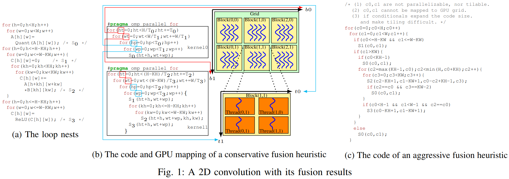
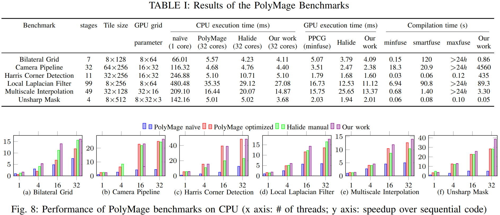
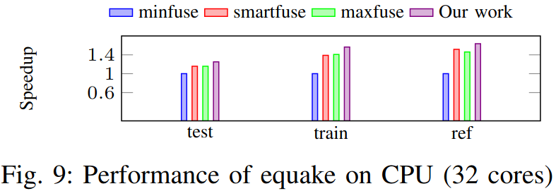
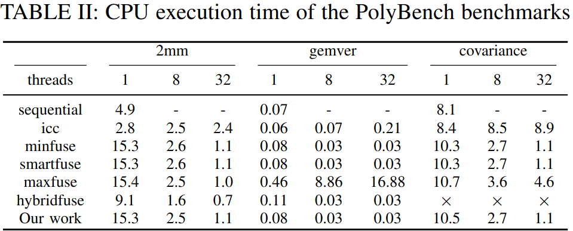
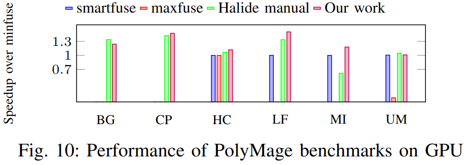
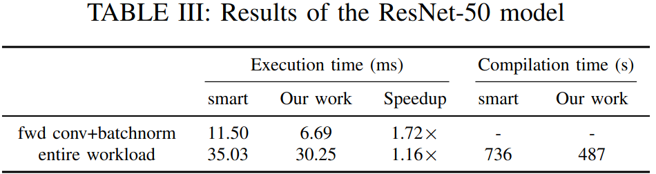

### Motivation

在现有多面体编译器采取先融合后分块策略不能完全利用内存分层，作者提出通过重排分块和融合的顺序来避免分块、并行性和局部性之间的权衡

### Overview

***constructing tile shapes***
- extracting upwards exposed data
- tiling intermediate computation spaces
- the tiling algorithm

***post-tiling fusion***
- facilitating fusion using schedule trees
- the fusion algorithm
- generalization
- general applicability

***code generation***
- domain-specific code generation
- aggressive memory optimizations

### Evaluation

### Reference
[Optimizing the Memory Hierarchy by  Compositing Automatic Transformations on  Computations and Data]()