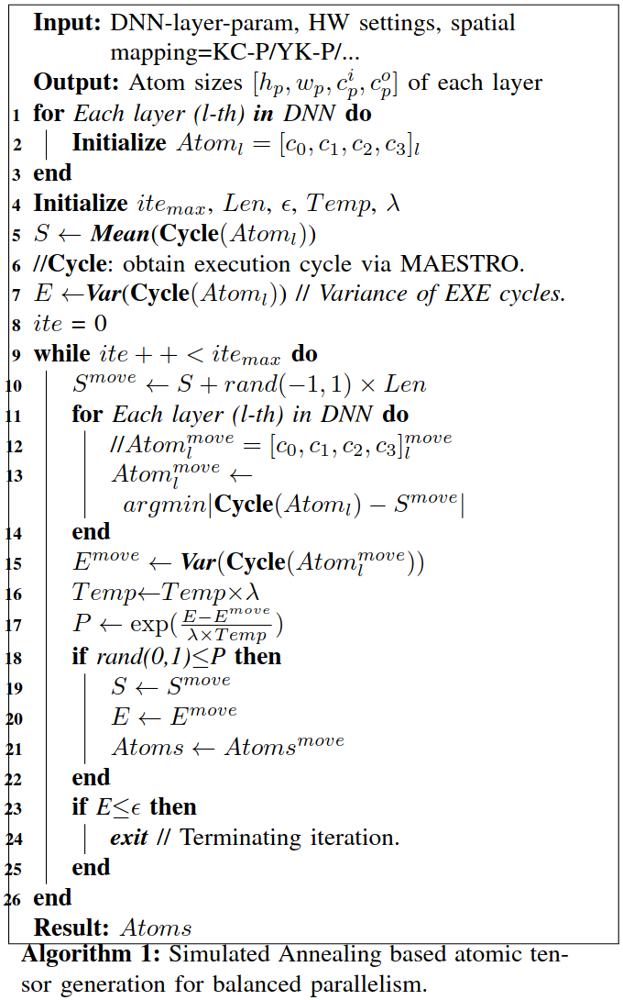

### Motivation
扩大计算资源不会带来成比例的加速由于其低利用率

### Overview

***Optimizing techniques***

- atomic tensor generation
优化原子的粒度的原因： 1.当执行原子每个引擎的高PE利用率 2.来自不同层的原子可以并行执行，它们应该有密切的计算延迟来避免负载不均衡

- atomic DAG scheduling

- atom-engine mapping and buffering strategy

### Evaluation

### Reference
[Atomic Dataflow based Graph-Level Workload Orchestration for Scalable DNN Accelerators]()