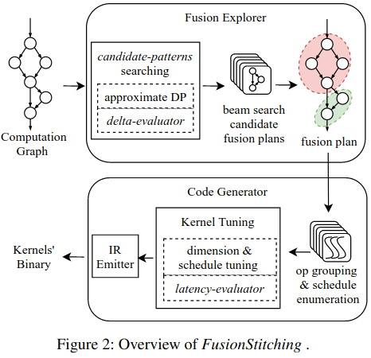
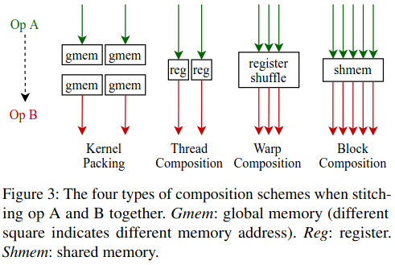
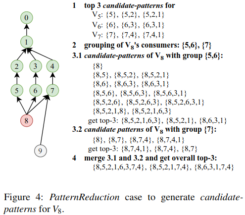
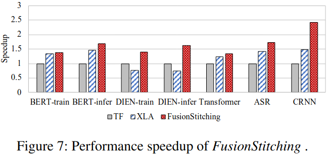
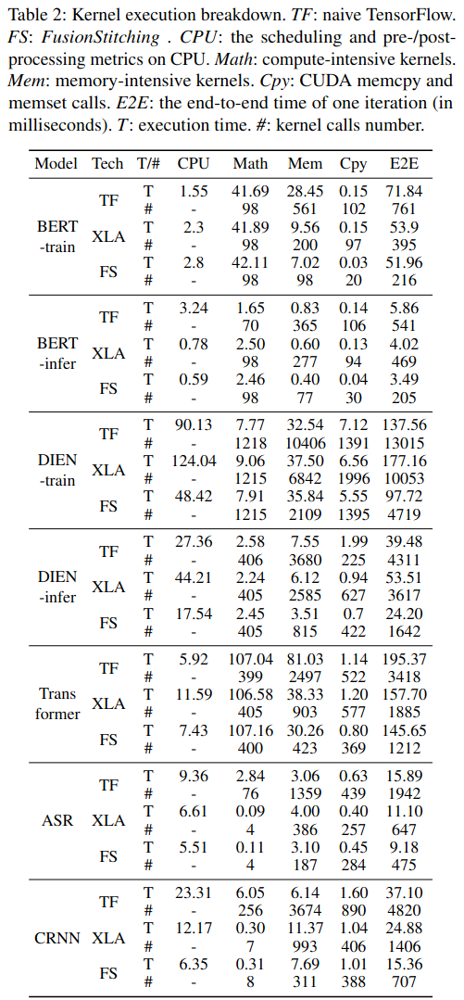

### Motivation
内存密集型算子占据模型执行的大部分时间，为内存密集型算子优化设计相应的库是不可行由于其简单性，目前方法是采取融合的方法
在JIT内核融合技巧使用简单代码生成和融合搜索方法，它只关注内存访问优化，缺乏考虑计算特性，存在一个重复计算的问题
XLA使用的搜索的算法都是保守的

### Overview
- data reuse
- fusionstitching system

***Code Generation***
- kernel composition schemes
kernel packing: 无数据依赖的算子
thread composition
warp composition

- kernel generation
- kernel evaluation: latency-evaluator
- shared memory optimization
- computation reuse optimizations

***Fusion Exploration***
- fusion problem definition
- explore fusion patterns
- generate overall fusion plan
- fusion evaluation: delta-evaluator

### Evaluation

### Reference
[FusionStitching: Boosting Memory Intensive Computations for  Deep Learning Workloads]()