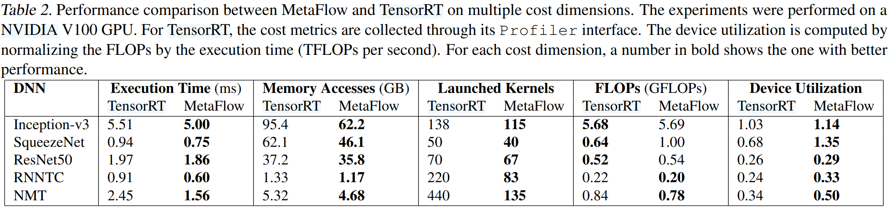

### Motivation
现有的深度学习编译器采用贪心算法来替换计算图，导致错过很多复杂优化机会

### Metaflow

***search algorithm***
- cost model
- backtracking search
- flow-based recursive graph split

### Evaluation

### Reference
[Optimizing DNN Computation with Relaxed Graph Substitutions](https://proceedings.mlsys.org/paper_files/paper/2019/file/4dd1a7279a8cfeea2660fbc34f02a2bc-Paper.pdf)