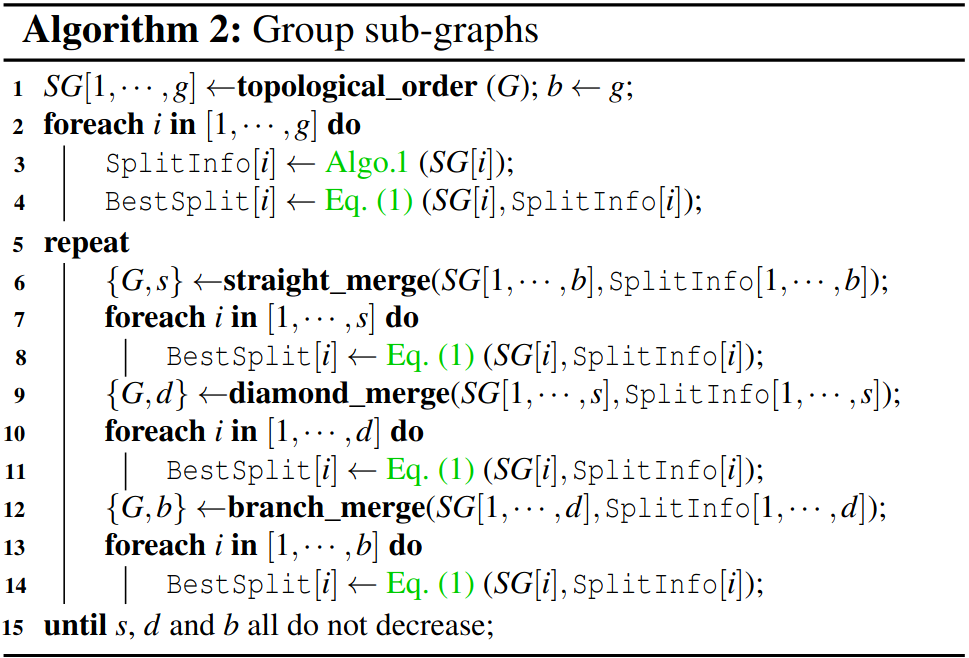

### Motivation
先前的方法没有考虑硬件架构，导致会产生更多的kernel和要求更多数据移动；生成细粒度的子图会导致错过跨层指令调度的机会；进一步导致不能充分利用更快的本地内存

### Overview of GraphTurbo

***scheduling sub-graph instances***
- collecting splitting information

- grouping sub-graphs

- ordering sub-graph instances

- inferring core binding and buffer scopes

- concatenating instance outputs
- generalizing the approach

***kernel generation for sub-graph instances***

- loop fusion within layers
- buffer stitching across layers/blocks
- memory allocation and reuse
- across-layer instruction scheduling

### Evaluation

### Reference
[Effectively Scheduling Computational Graphs of Deep Neural Networks toward Their Domain-Specific Accelerators](https://www.usenix.org/system/files/osdi23-zhao.pdf)