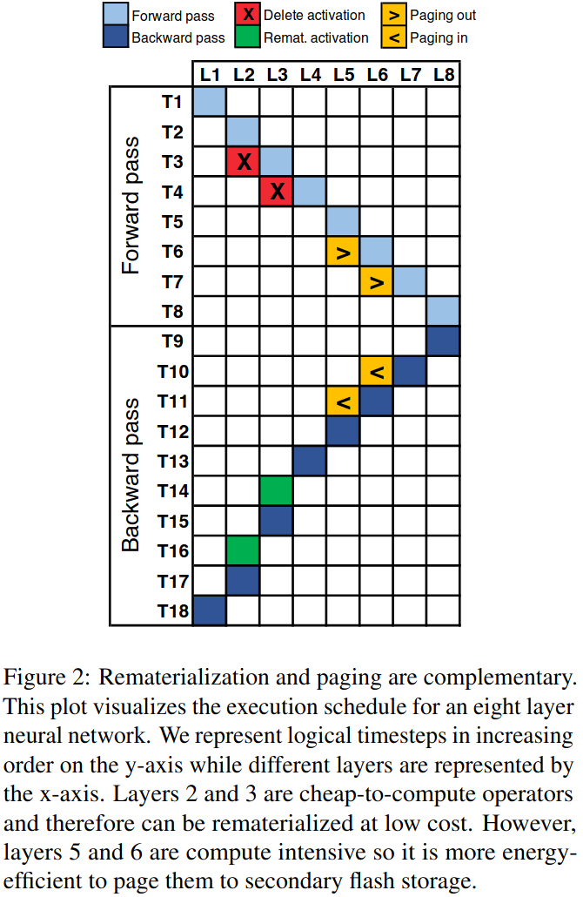
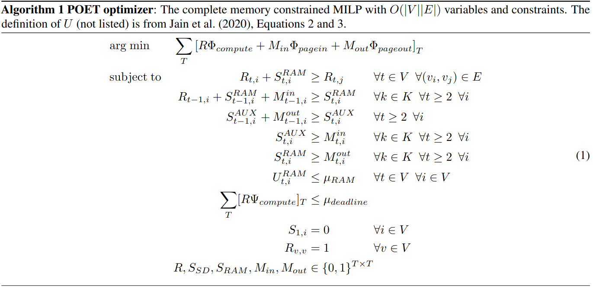
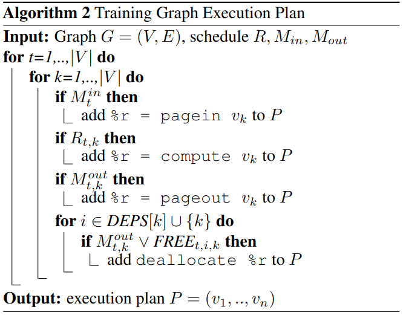
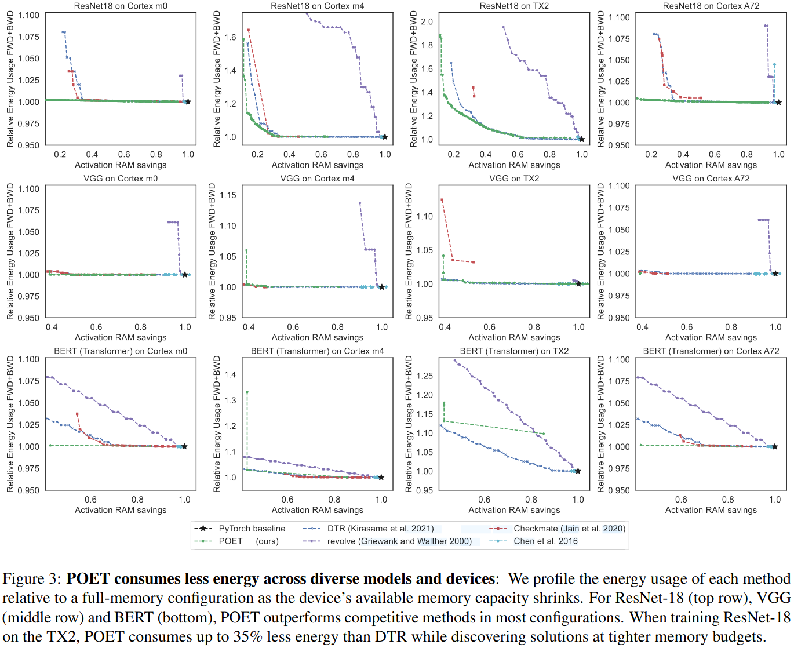
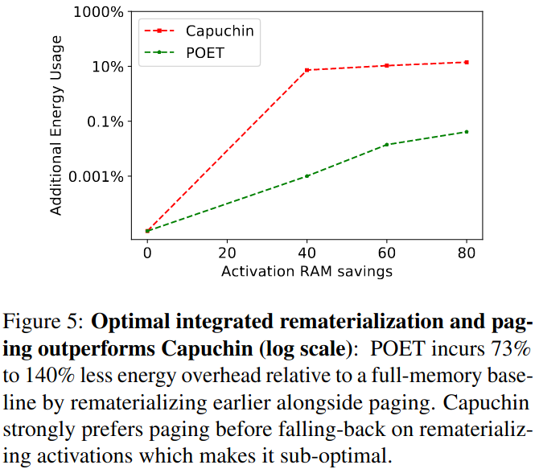
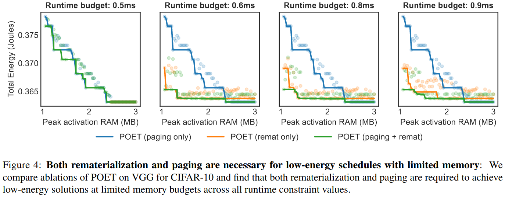

### POET

***Integrated paging and rematerialization***

***private optimal energy training***
- optimal rematerialization
- optimal integrated paging and rematerialization
- expressing an energy consumption objective
- ensuring minimum training throughput
- paging latency hiding via transfer planner

### Evaluation

### Reference
[POET: Training Neural Networks on Tiny Devices with Integrated Rematerialization and Paging](https://proceedings.mlr.press/v162/patil22b/patil22b.pdf)