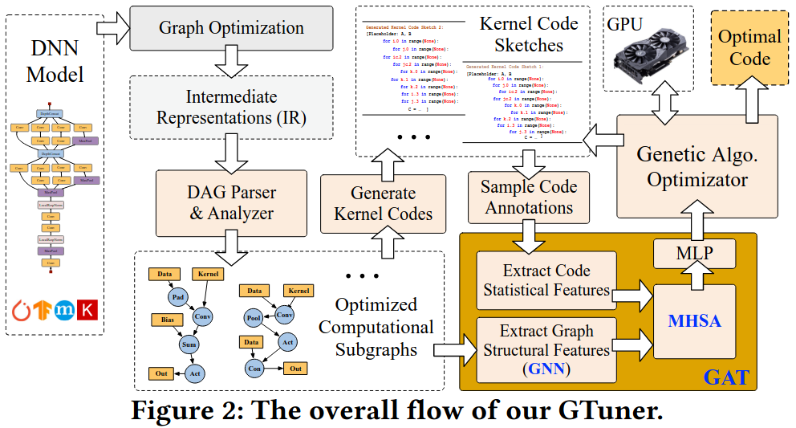
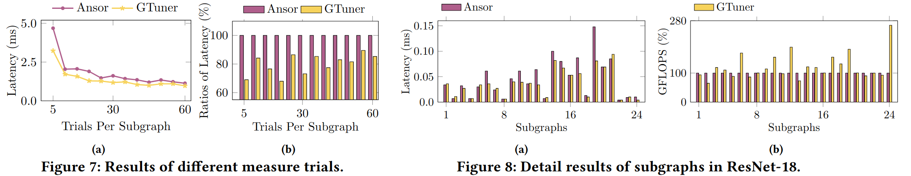
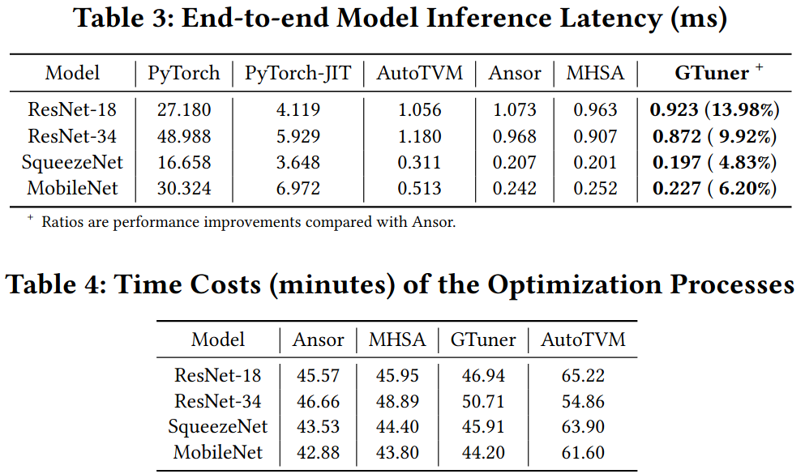

### Motivation
现有的方法利用代码的统计信息来训练代价模型，但是结构信息没有被利用

### GAT

### Evaluation

### Reference
[GTuner: Tuning DNN Computations on GPU via Graph Attention Network](https://dl.acm.org/doi/pdf/10.1145/3489517.3530584)