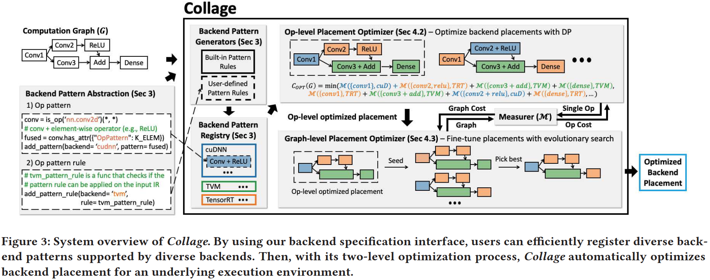
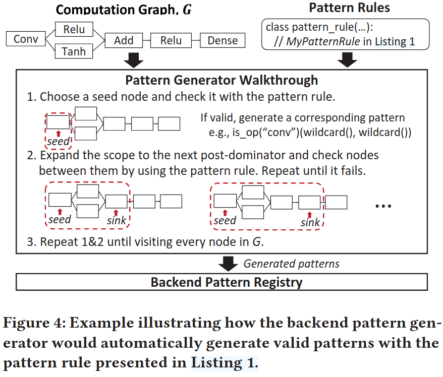
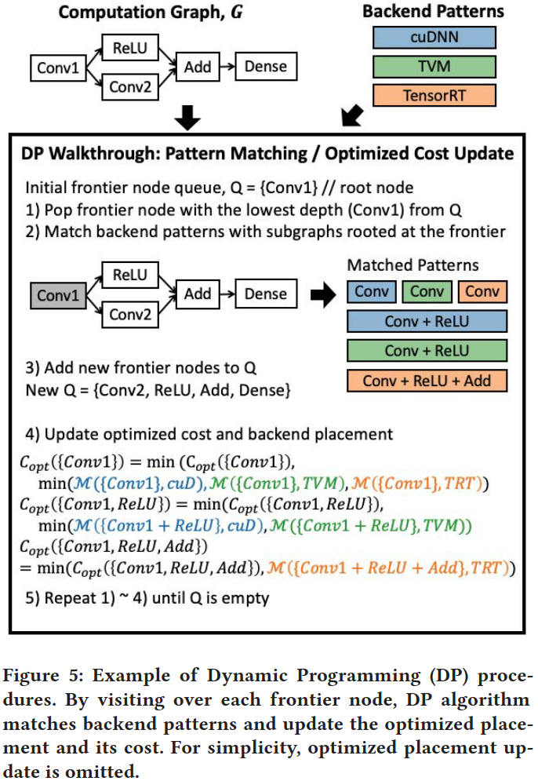
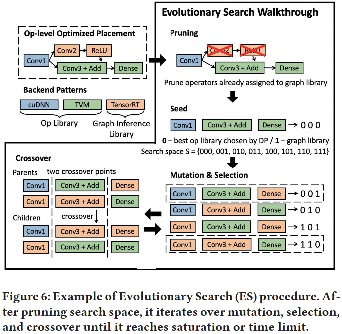
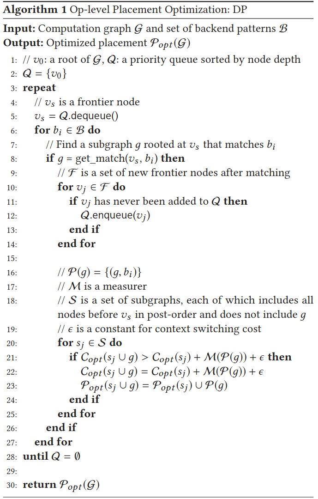
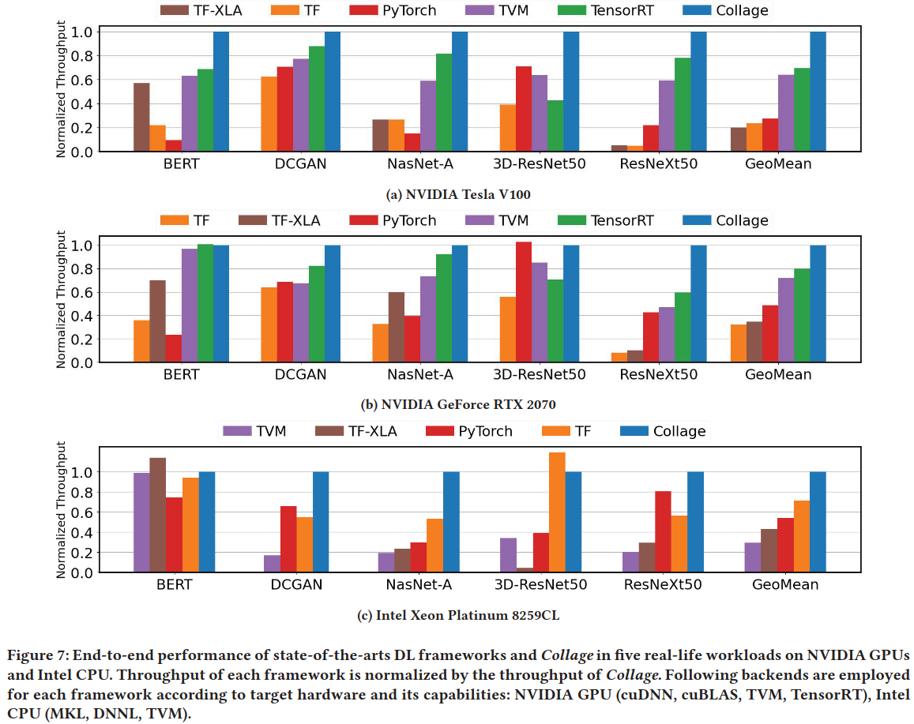
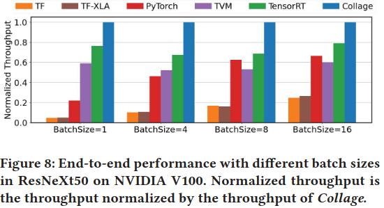

### Motivation
1.融合具有不同特性的各种各样的硬件后端同时维持它们的全部性能是不简单的 2.后端放置的搜索空间是巨大的

### Overview

***backend pattern abstraction***

***backend placement optimization***

### Evaluation

### Reference
[Collage: Seamless Integration of Deep Learning Backends with Automatic Placement](https://dl.acm.org/doi/pdf/10.1145/3559009.3569651)