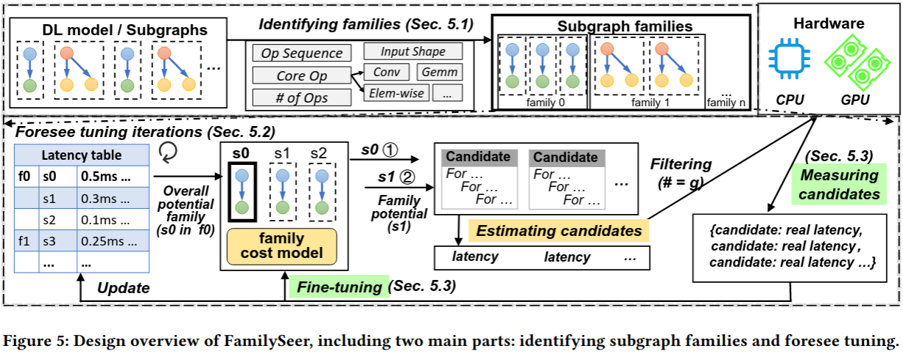
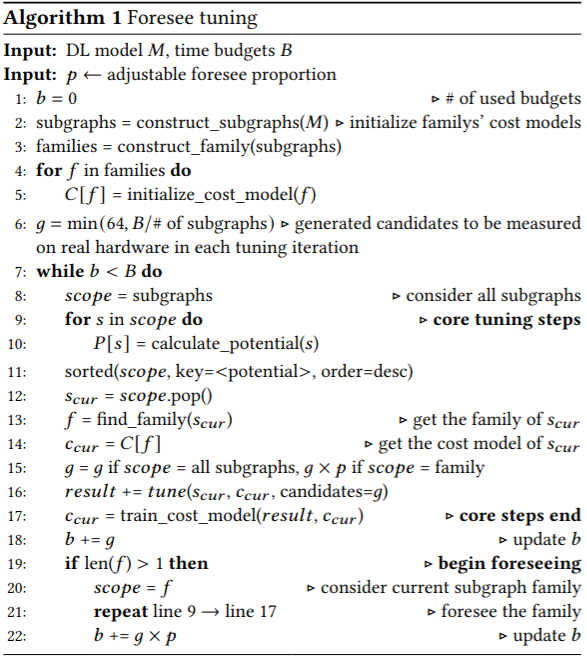
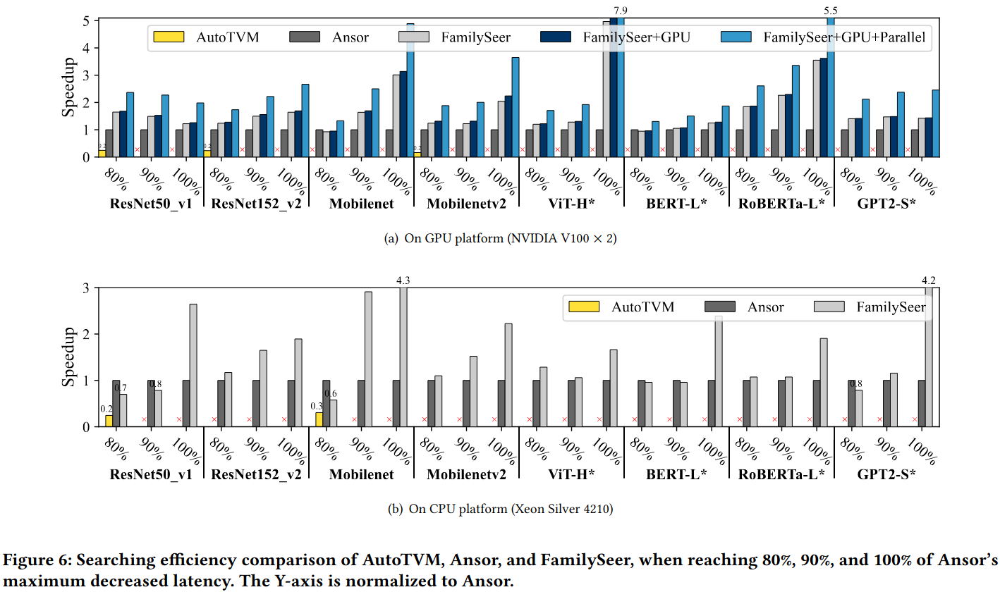
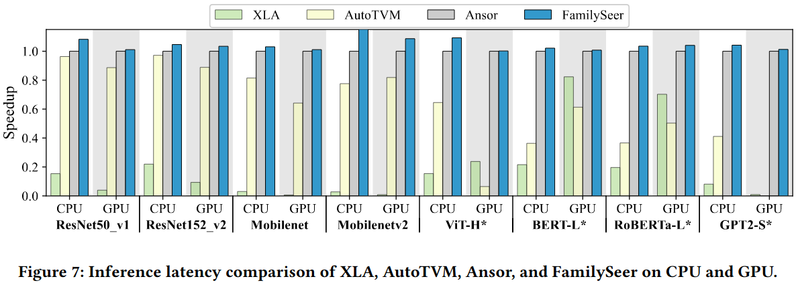

### Motivation
现在的方法采用单一的代价模型忽略不同子图的相似性，错失机会来提升模型搜索质量和效率；浪费时间在没有性能提升的子图上

### FamilySeer

### Evaluation

### Reference
[Exploiting Subgraph Similarities for Efficient Auto-tuning of Tensor Programs](https://dl.acm.org/doi/pdf/10.1145/3605573.3605596)