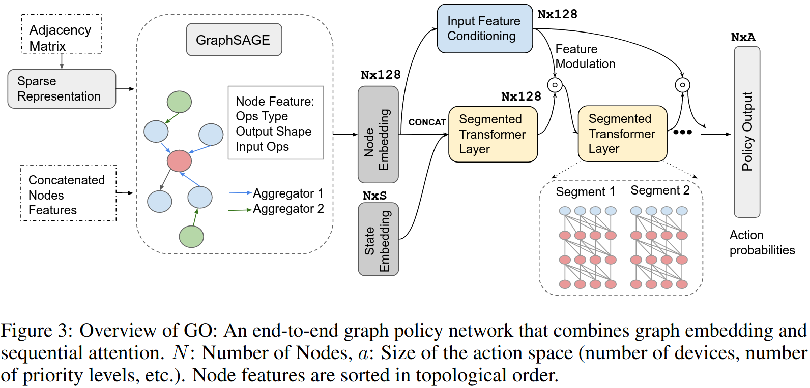
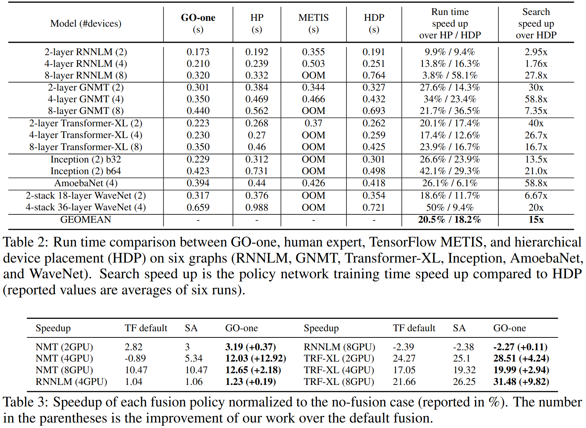

### Motivation
1.启发式算法经常会导致次优配置特别是先前未见过的模型架构 2.现有的编译器错过联合优化机会

### Network Architecture

### Evaluation

### Reference
[Transferable Graph Optimizers for ML Compilers](https://proceedings.neurips.cc/paper_files/paper/2020/file/9f29450d2eb58feb555078bdefe28aa5-Paper.pdf)