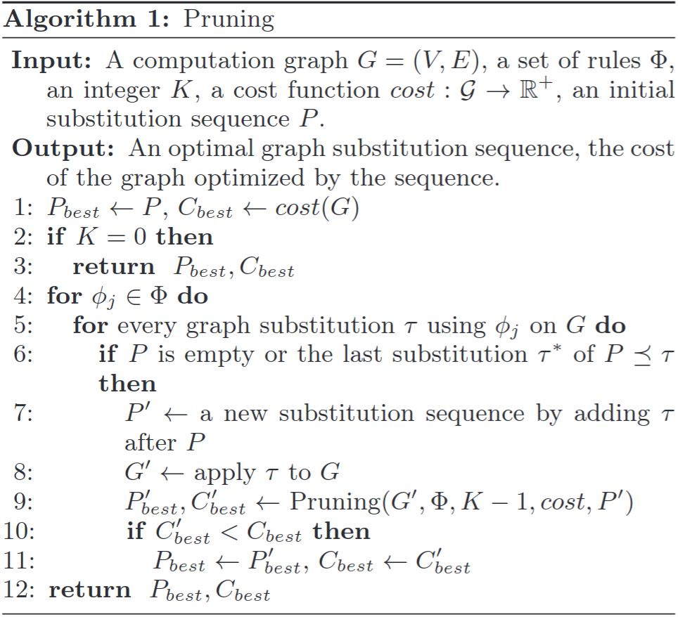
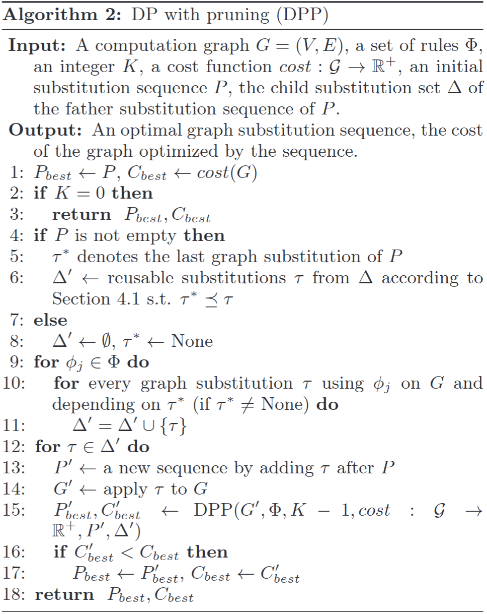
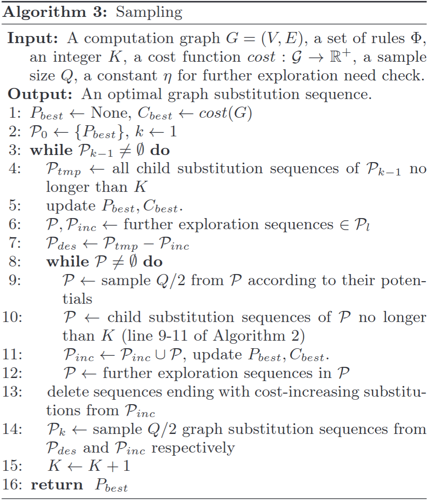
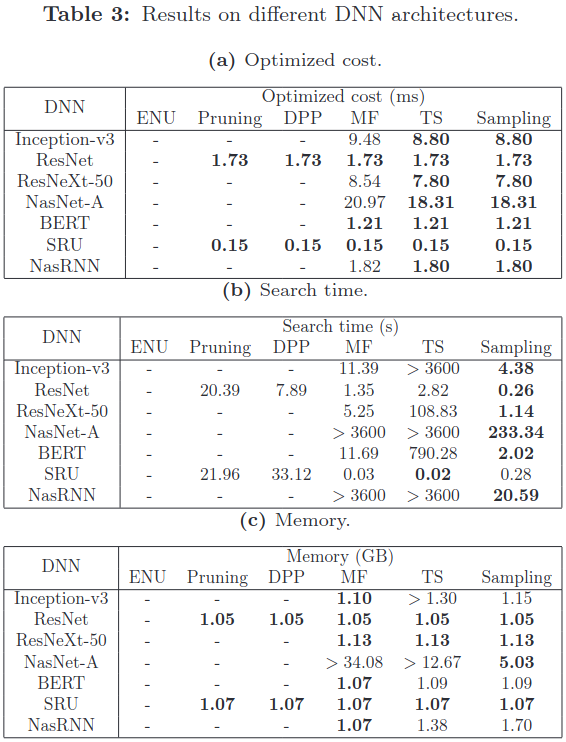
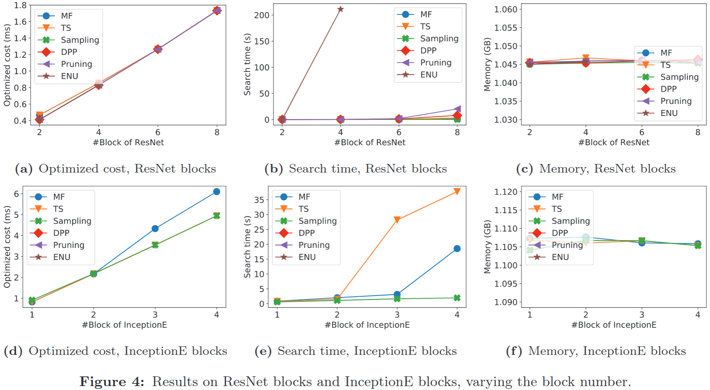
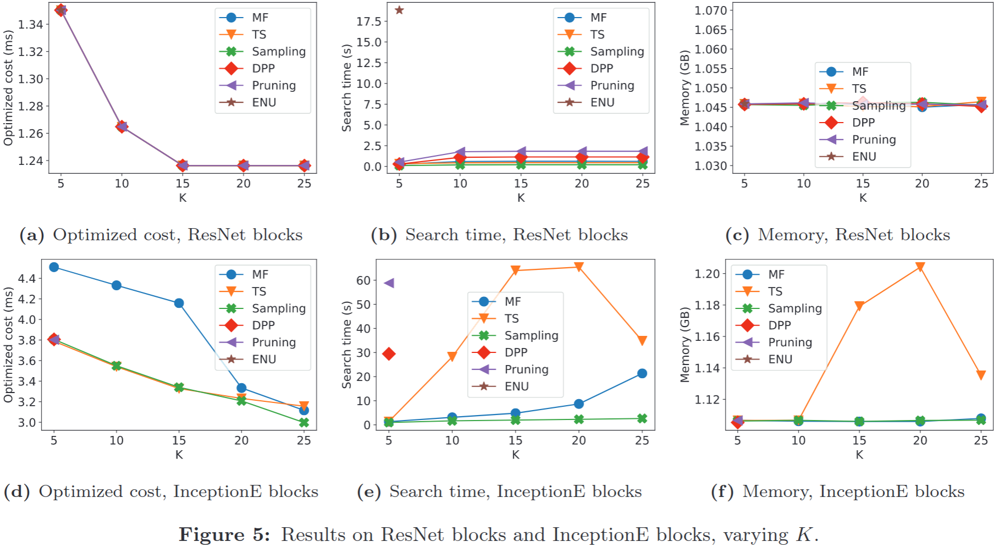

### Motivation
an efficient pruning-based method: 减少检查冗余计算图替换序列
a dynamic programming algorithm: 充分利用已探索过的图替换来加速搜索过程

### OCGGS

***preliminaries***
- computation graph and cost function
- definitions and problem

***pruning-based algorithm***
- partial order
- pruning rule

***dynamic programming***
- dynamic programming algorithm

***sampling-based approximation algorithm***

### Evaluation

### Reference
[Optimizing DNN Computation Graph using Graph Substitutions](https://repository.hkust.edu.hk/ir/bitstream/1783.1-122917/1/1122917.pdf)