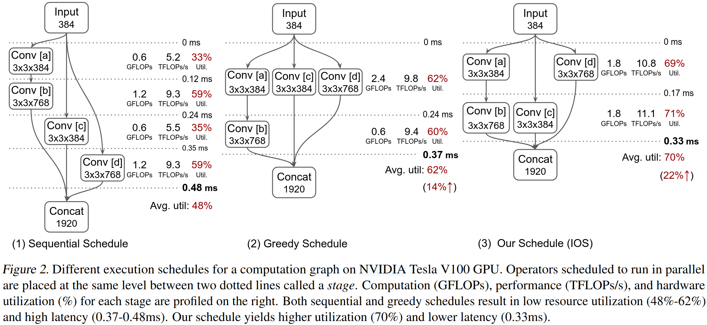
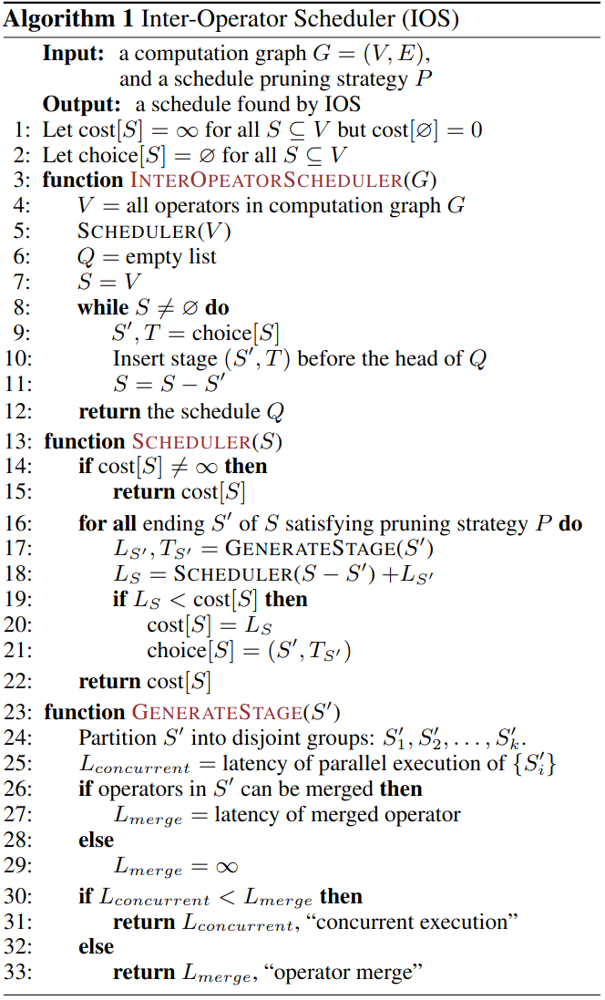
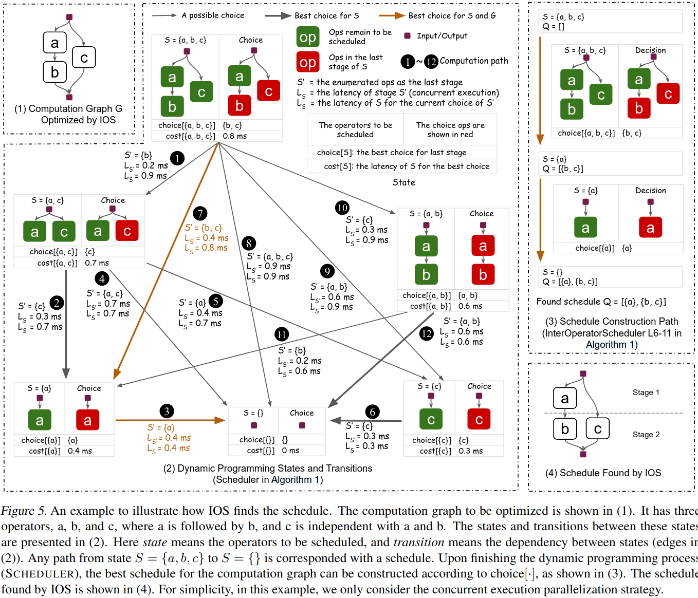
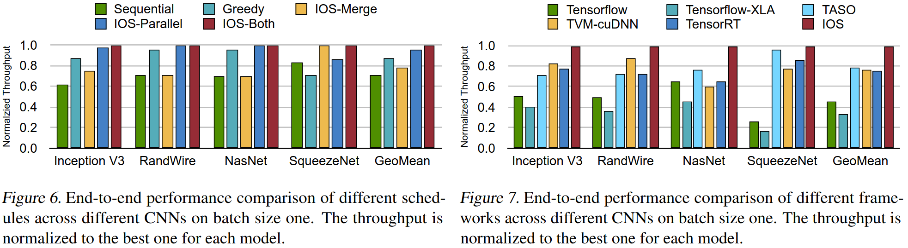
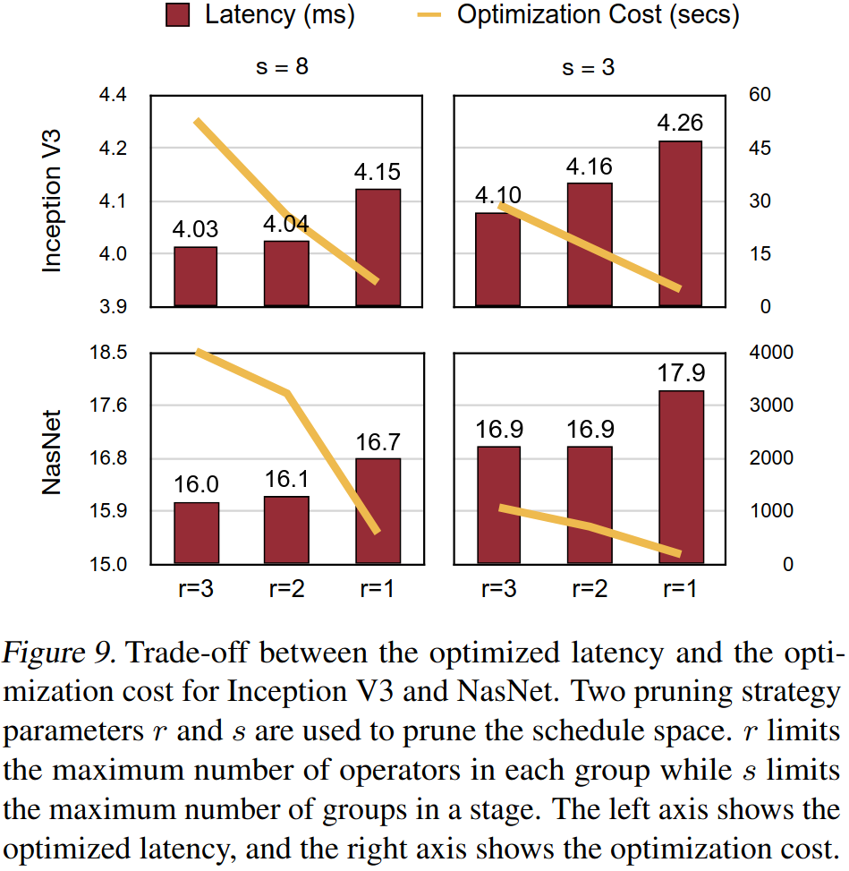
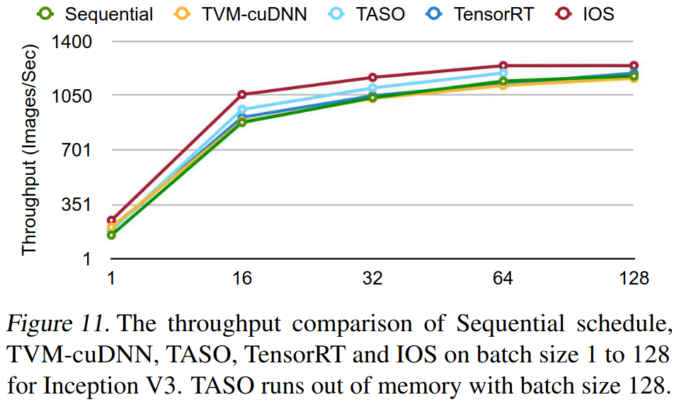
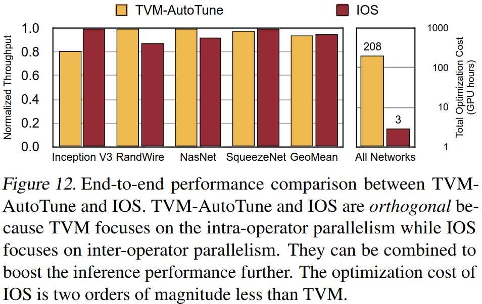

### Motivation
贪心调度会导致次优原因：1.贪心调度倾向于把更多算子放心早期阶段，导致后续阶段的低利用率 2.在设备并发执行太多算子会导致资源争用损害性能

### Method

***IOS design***

***the time complexity of IOS***

***the pruning optimization to reduce the search time of IOS***

### Evaluation

### Reference
[IOS: Inter-Operator Scheduler for CNN Acceleration](https://proceedings.mlsys.org/paper_files/paper/2021/file/1f8053a67ec8e0b57455713cefdd8218-Paper.pdf)