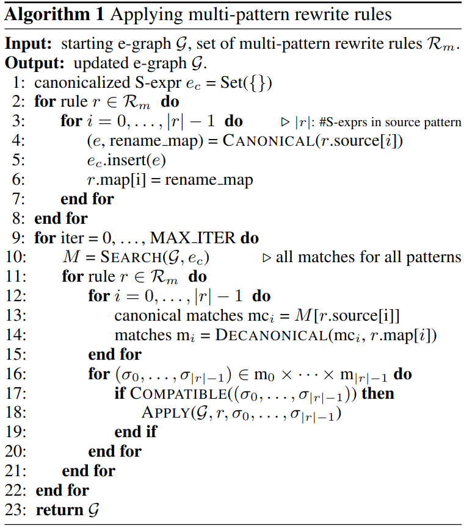
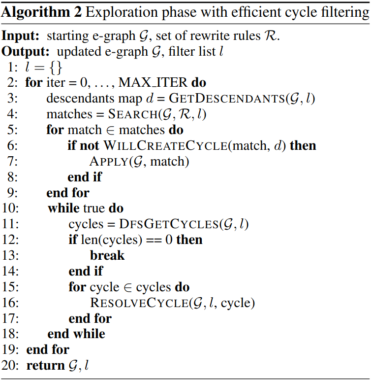
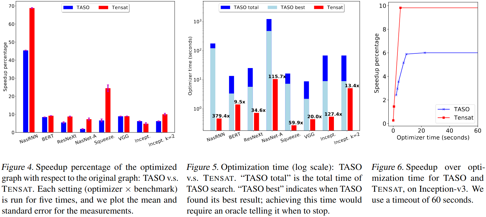
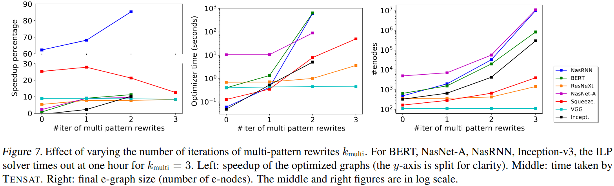
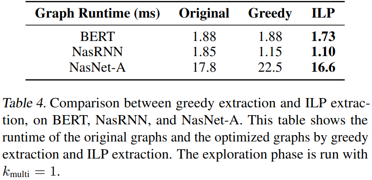
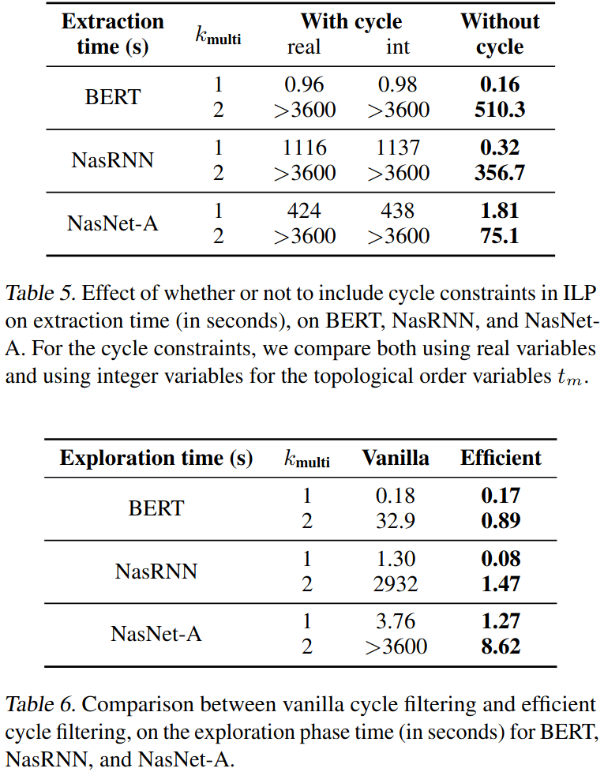

### Motivation
现有的方法都是采用人工设计的重写规则然后依靠启发式策略来决定以何种顺序应用重写规则，这种方法容易导致次优

### Tensat

***tensat's representations***

***tensat's exploration phase***

***tensat's extraction phase***

### Evaluation

***Ablation Study***

### Reference
[Equality Saturation for Tensor Graph Superoptimization](https://proceedings.mlsys.org/paper_files/paper/2021/file/cc427d934a7f6c0663e5923f49eba531-Paper.pdf)