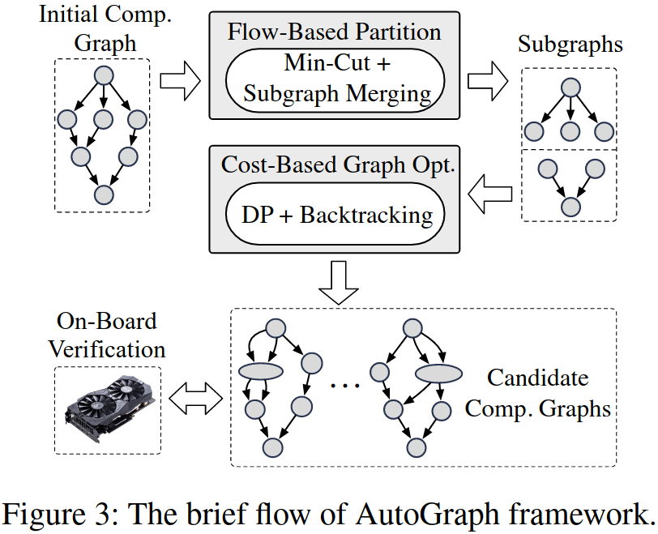
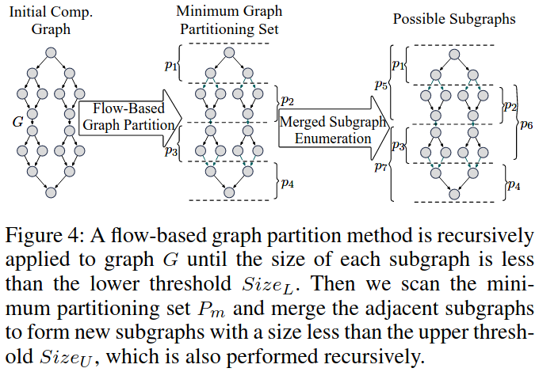
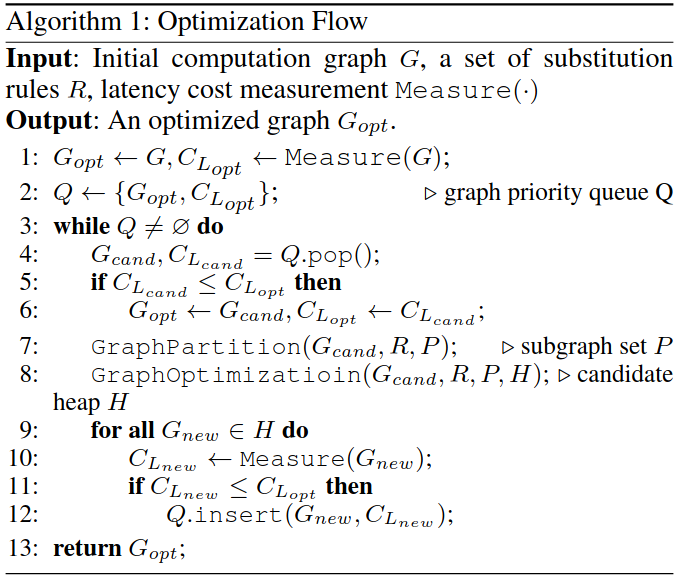
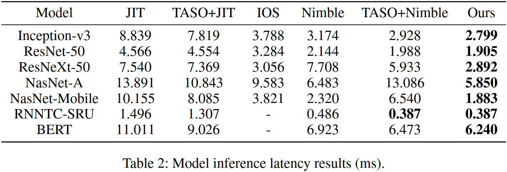
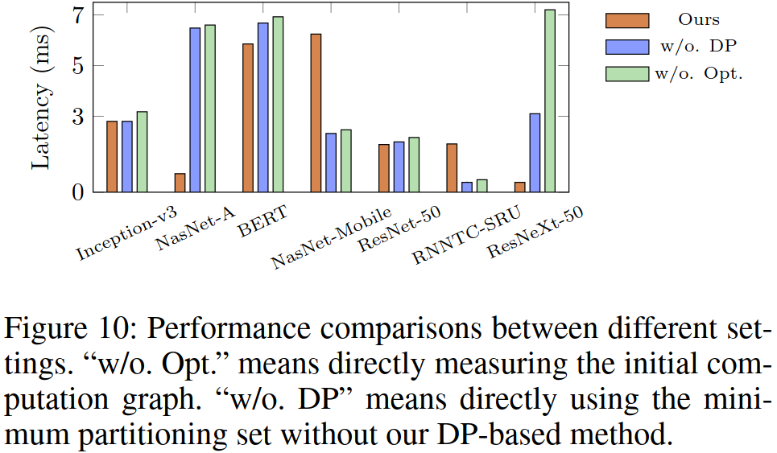

### Motivation
图中节点的代价就是相应算子在GPU上的运行时间，整个图的代价就是所有节点之和，这种评价尺度忽略了内核并行执行的场景，会引导优化进入错误的方向

### AutoGraph

***flow-based graph partition***

***cost-based graph optimization***
- backtracking search via mixed critical path cost
- dp-based optimized solution search

$$
\begin{align}
C_E &= \alpha \sum_{v \in V_C} cost(v) + \sum_{v \in V} cost(v) \\
&= (1 + \alpha) \sum_{v \in V_C} cost(v) + \sum_{v \in V-V_C} cost(v).
\end{align}
$$

***on-board verification***

***overall optimization flow***

### Evaluation

### Reference
[AutoGraph: Optimizing DNN Computation Graph for Parallel GPU Kernel Execution](https://ojs.aaai.org/index.php/AAAI/article/view/26343)