### Motivation
现有高效基于搜索的深度学习编译器利用学习代价模型导致搜索时间十分耗时；一个训练好的代价模型只能在某一平台而在另一平台不能被应用

### Pruner

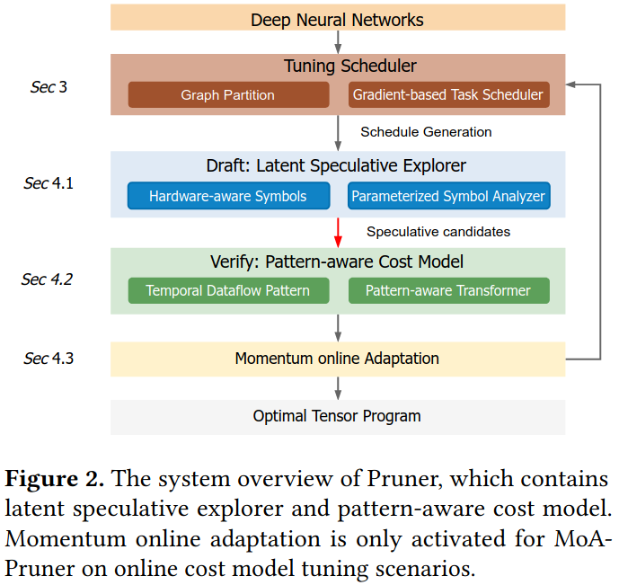

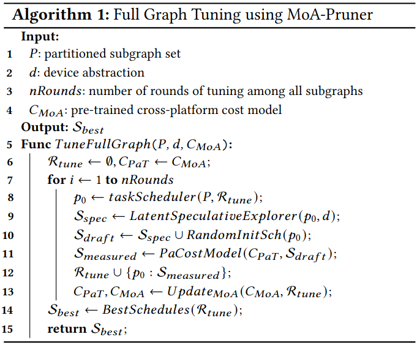

***Draft: Latent Speculative Explorer***
- hardware-aware symbbols
- hardware-aware penalty
- parameterized symbol analyzer

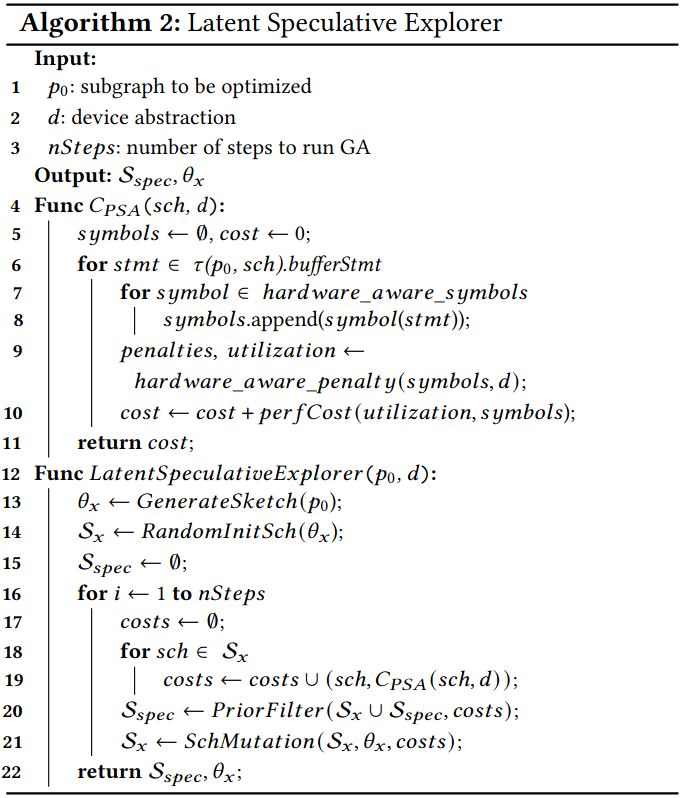

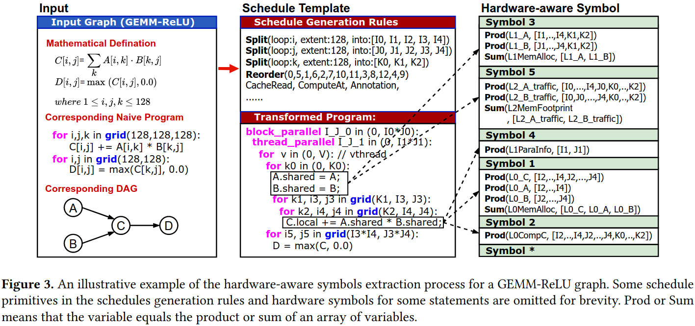

***verify: pattern-aware cost model***
- feature representation
- pattern-aware transformer

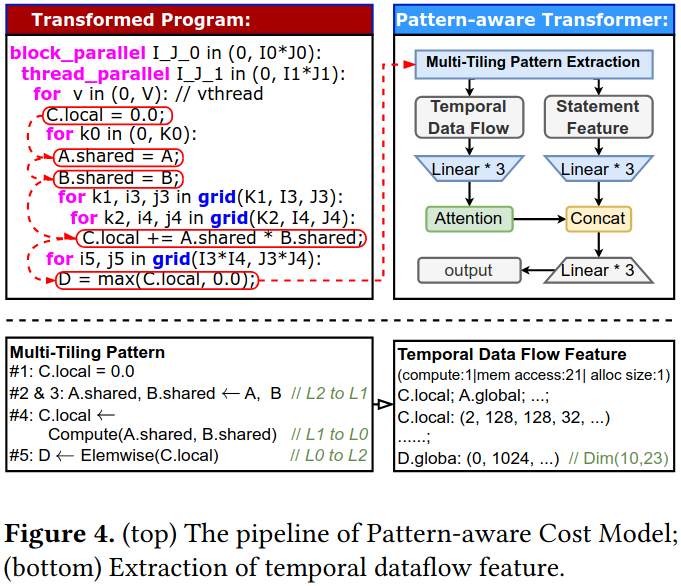

***MoA-Pruner***
- momentum online adaptation

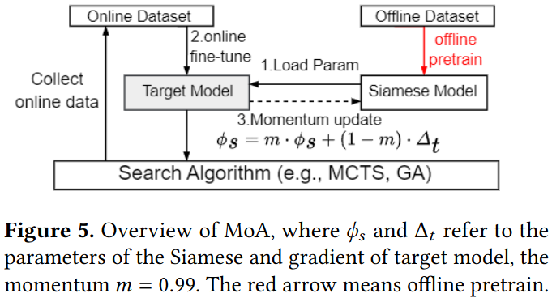

### Evaluation

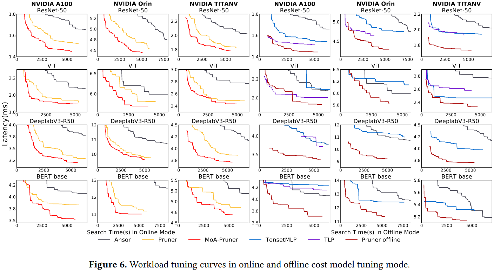

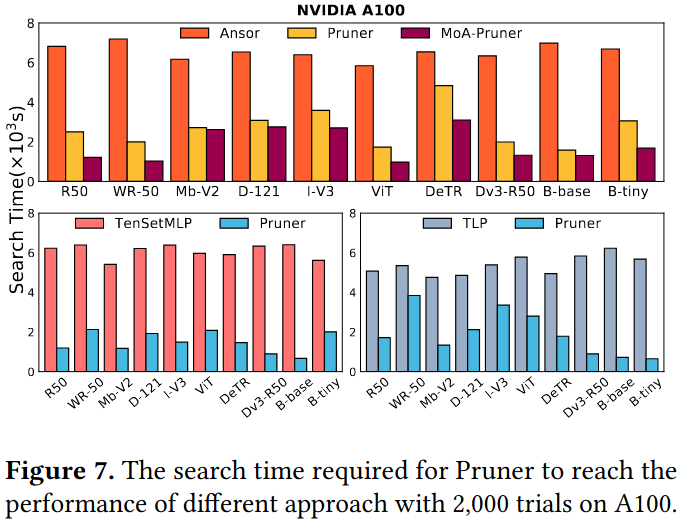

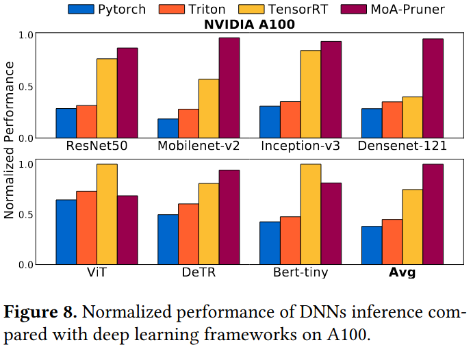

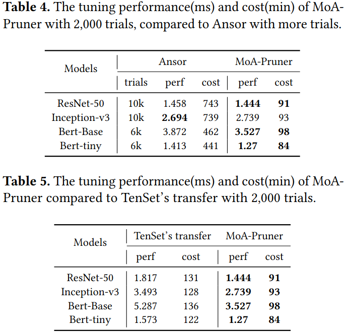

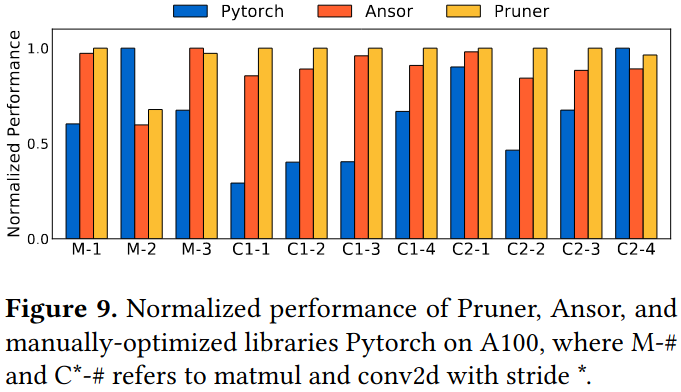

### Reference
[Pruner: A Speculative Exploration Mechanism to Accelerate Tensor Program Tuning](https://arxiv.org/pdf/2402.02361)