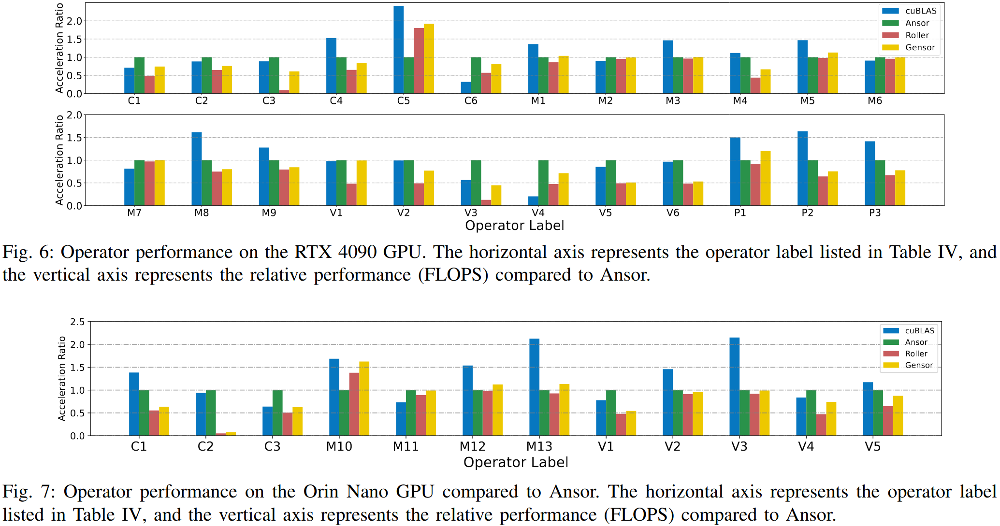
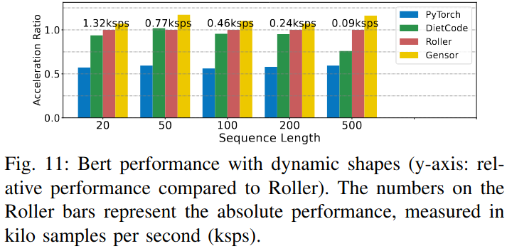

### Motivation
基于搜索的张量编译受限于高计算开销，而基于树遍历的方法受限于单一目标的单向功能导致搜索空间受限

### Gensor

### Evaluation

### Reference
[Gensor: A Graph-based Construction Tensor Compilation Method for Deep Learning](https://arxiv.org/pdf/2502.11407)