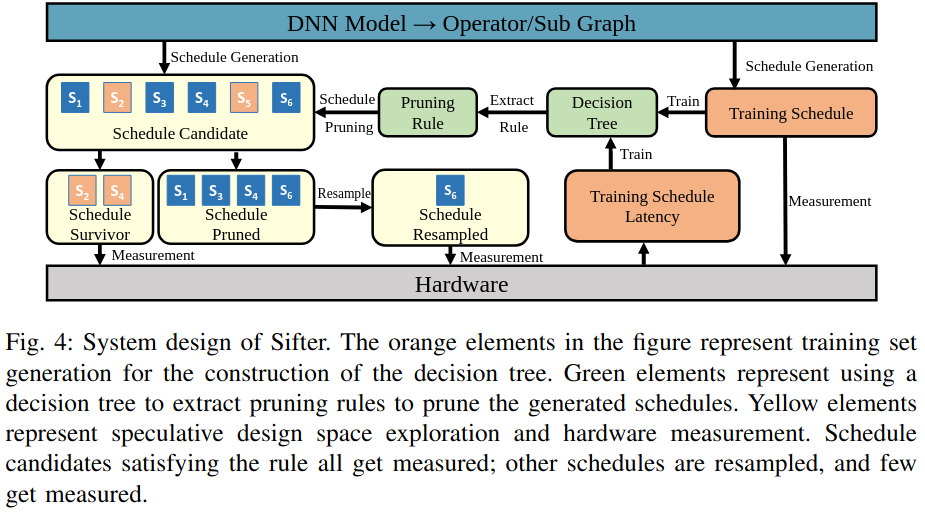
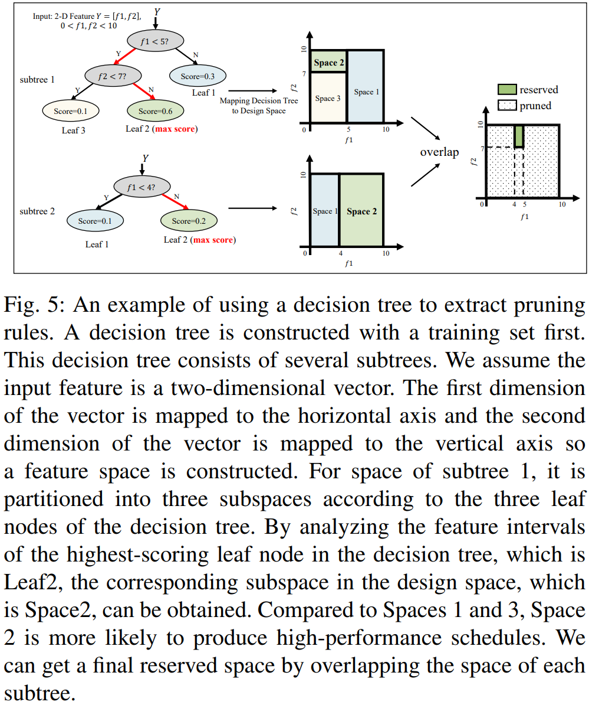
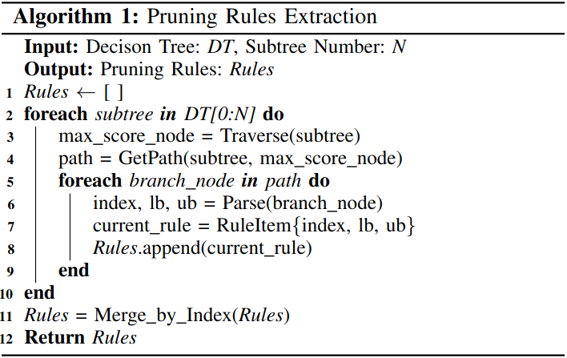
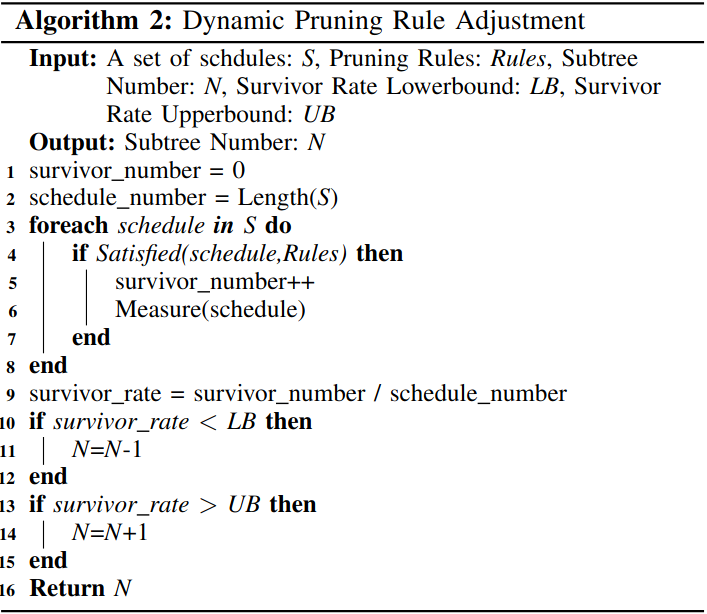
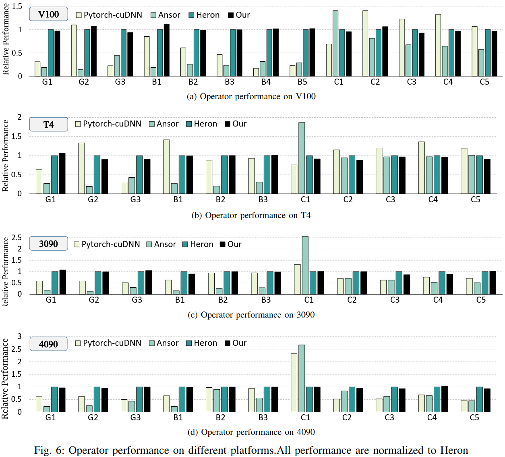
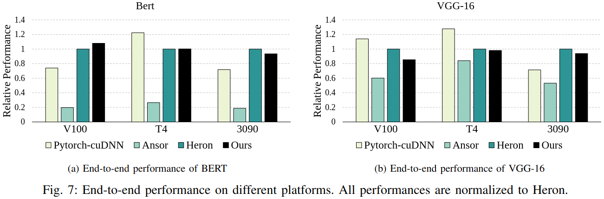
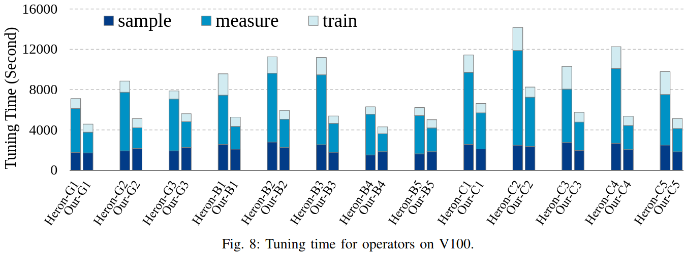
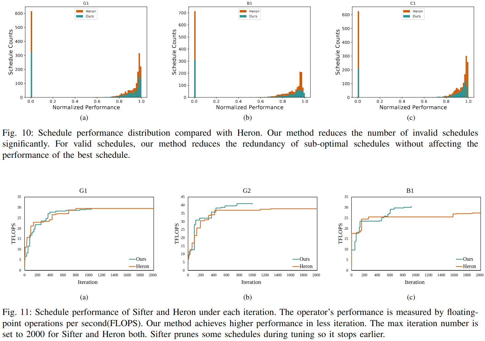

### Motivation
1.基于搜索的方法要求一个巨大空间搜索来生成最优的调度 2.编译器必须执行成千次在调优过程生成的调度来测量它们真实执行时间

### Sifter

***Construct Decision Tree***

***Extract Pruning Rules***

***Hardware Measurement***

***Dynmic Pruning Rule Adjustment***

### Evaluation
***operator performance***

***end-to-end performance***

***tuning time***

### Reference
[Sifter: An Efficient Operator Auto-Tuner with Speculative Design Space Exploration for Deep Learning Compiler](https://ieeexplore.ieee.org/stamp/stamp.jsp?tp=&arnumber=10643602)