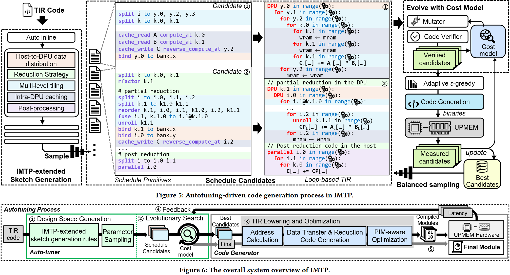
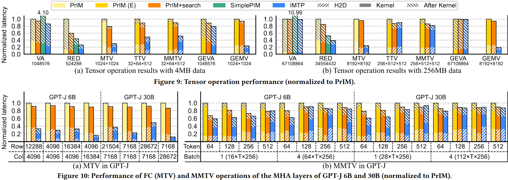
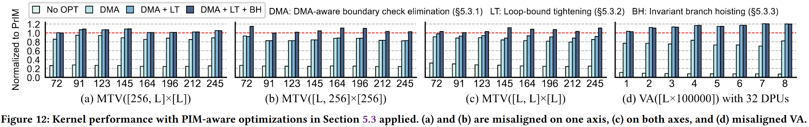
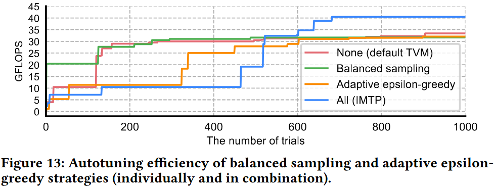

### Motivation
现在UPMEM的软件栈只提供局限的高级抽象的低级编程模型，要求大量开发和转变努力；DPU内和DPU间的优化有大量搜索空间与性能影响有关的参数；UPMEM计算单元由于未优化的分支操作遭受低利用率

### Design

post-imtp-code-generation.png

post-imtp-example.png

***Tunable Host and Kernel Operations***

***Search-based Code Generation***

***PIM-aware Optimizations***

***UPMEM Backend and Runtime Support***

### Evaluation

### Reference
[IMTP: Search-based Code Generation for In-memory Tensor Programs](https://arxiv.org/pdf/2412.19630)