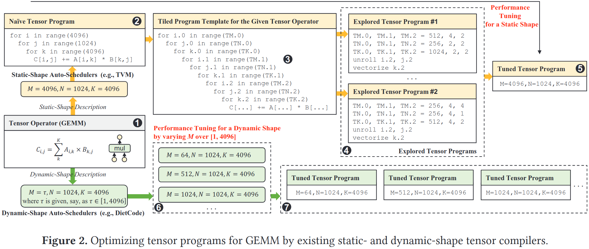
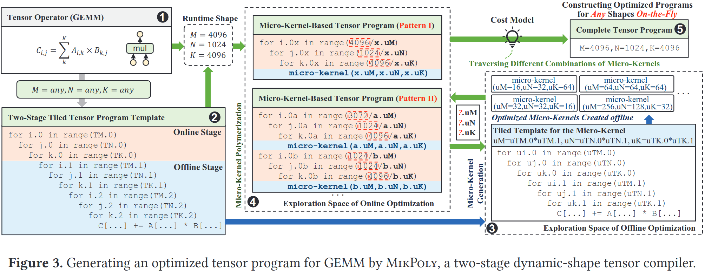
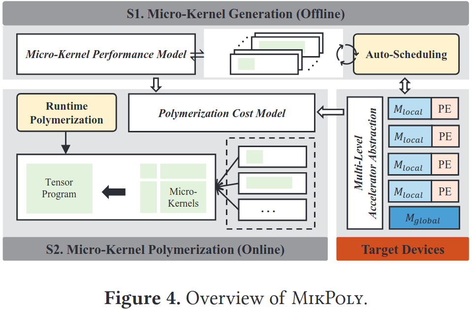
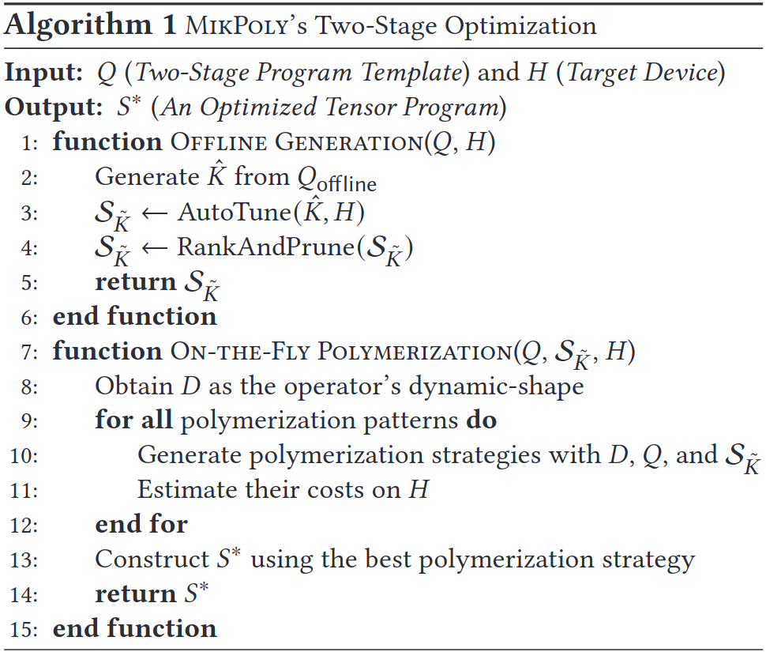
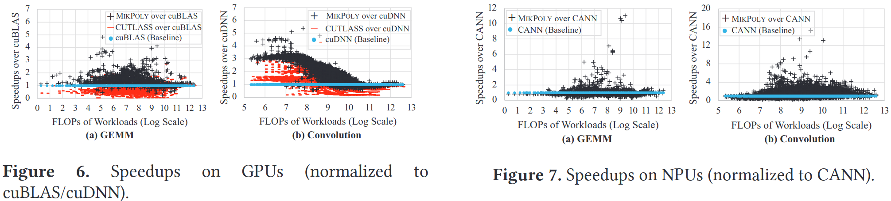
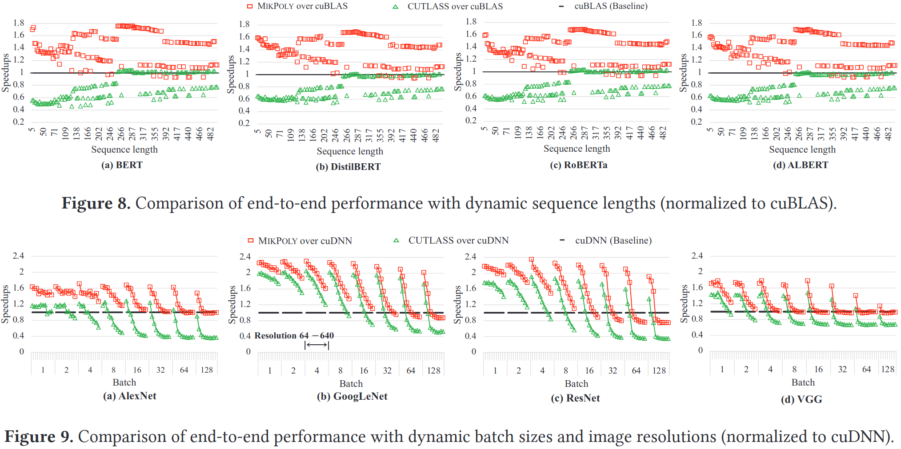

### Motivation
现有静态或者动态编译器优化张量程序都是针对特定输入形状，对于在其输入范围的会导致潜在性能下降或者运行错误，即使在其输入范围也会导致次优张量程序

### Overview

***Multi-Level Accelerator Abstraction***

***Two-Stage Optimization***

***Micro-Kernel Generation***

***Micro-Kernel Polymerization***

***Putting it All Together***

### Evaluation

### Reference
[Optimizing Dynamic-Shape Neural Networks on Accelerators via On-the-Fly Micro-Kernel Polymerization](https://dl.acm.org/doi/pdf/10.1145/3620665.3640390)