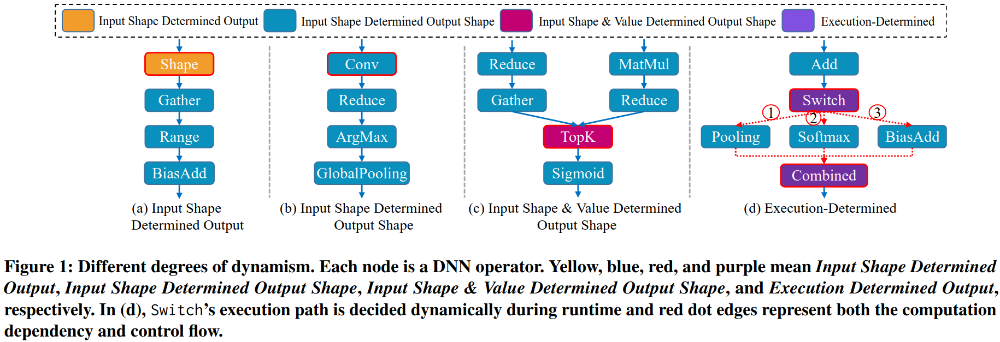
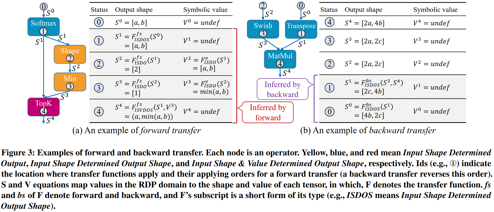
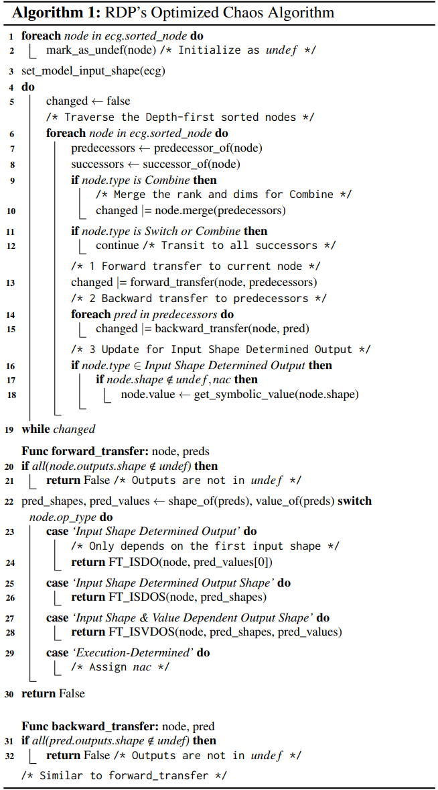
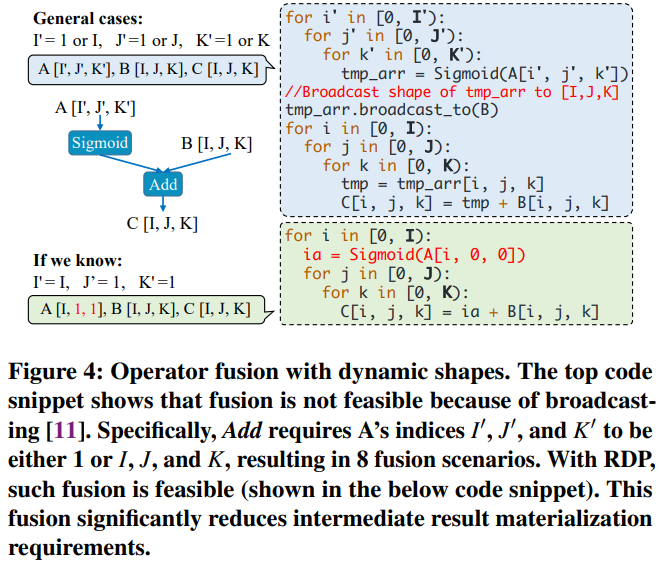
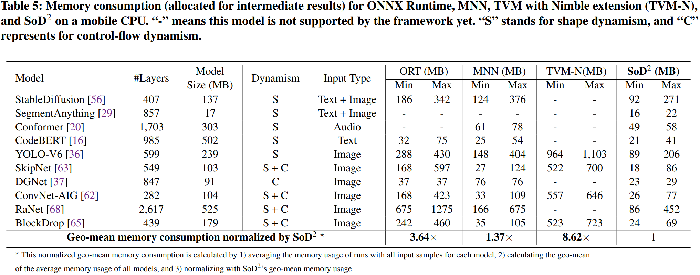
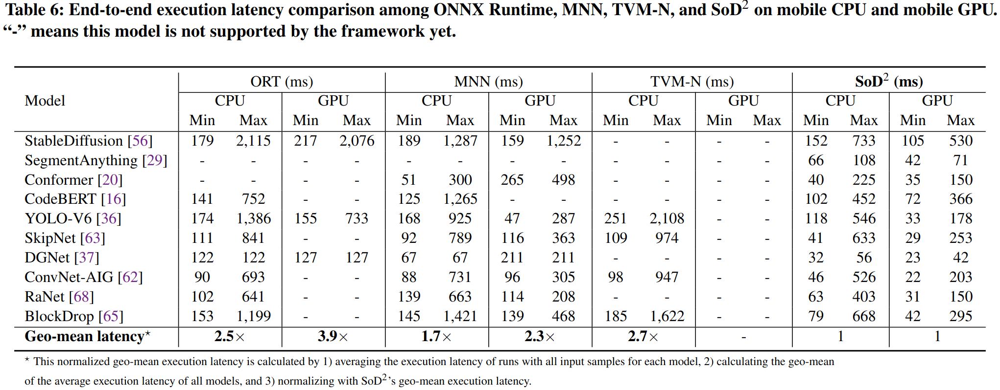
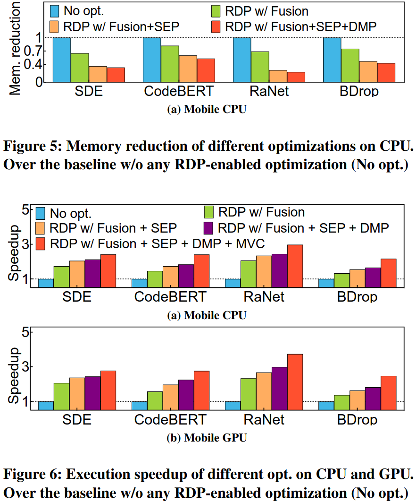
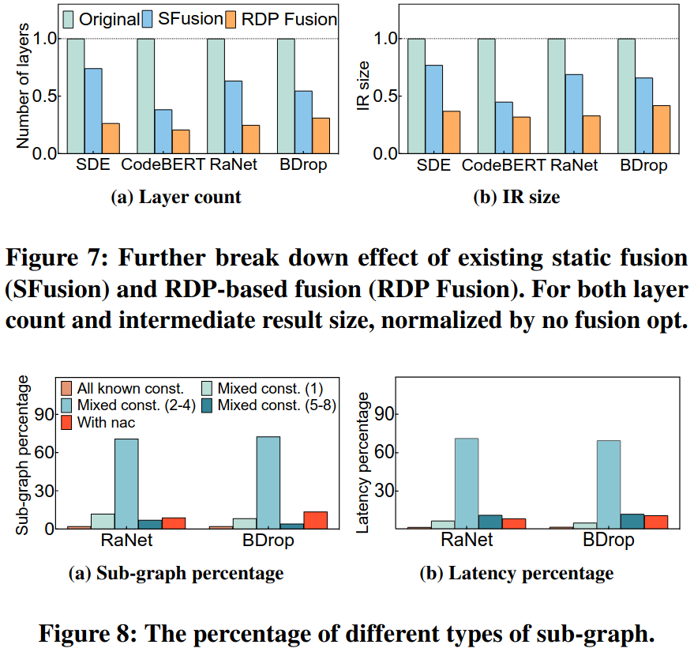
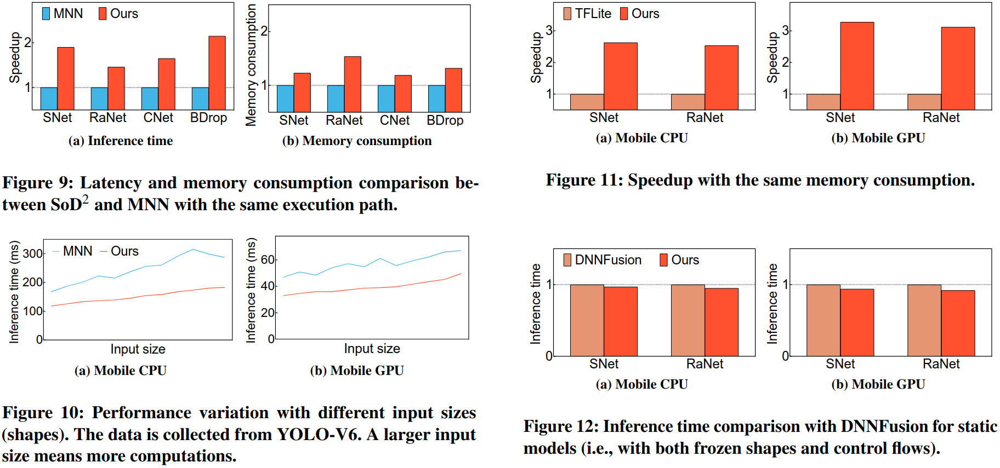

### Motivation
静态的方法容易招致大量执行和内存开销

### Operation classification based on dynamism

### Design

***Pre-Deployment Data-Flow Analysis***

***operator fusion for dynamic dnn based on rdp***

***static executionj planning based on rdp***

***other optimizations***
- memory allocation plan
- rdp-based multi-version code generation

### Evaluation

### Reference
[SoD2: Statically Optimizing Dynamic Deep Neural Network Execution](https://arxiv.org/pdf/2403.00176)