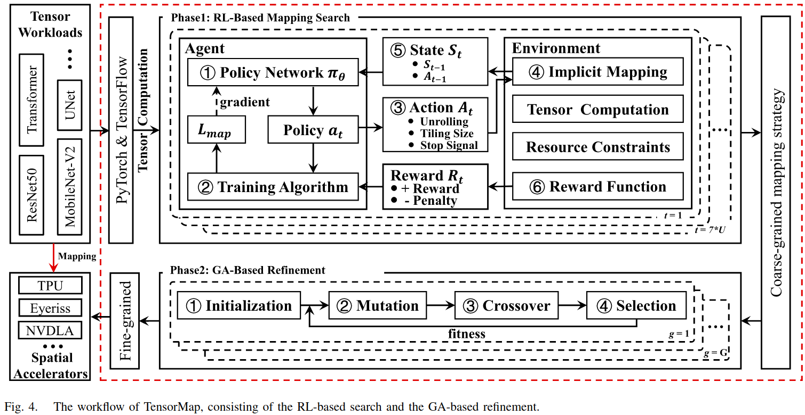
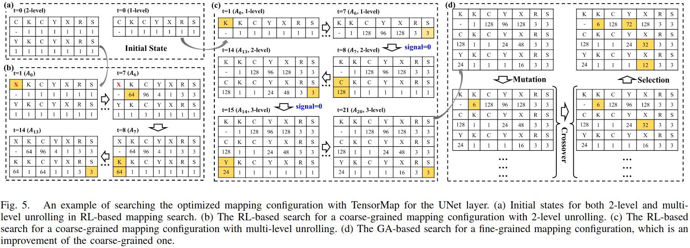
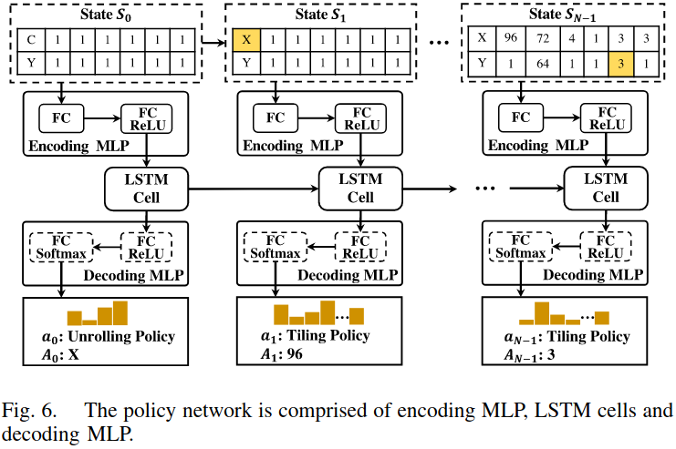
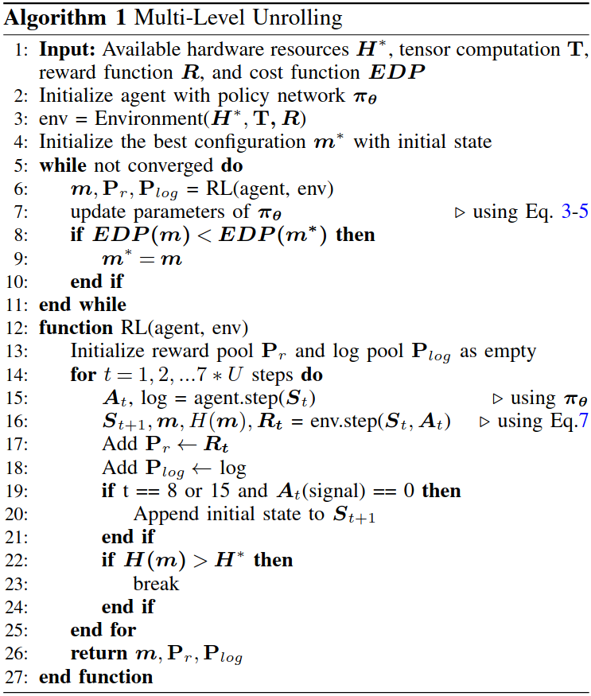
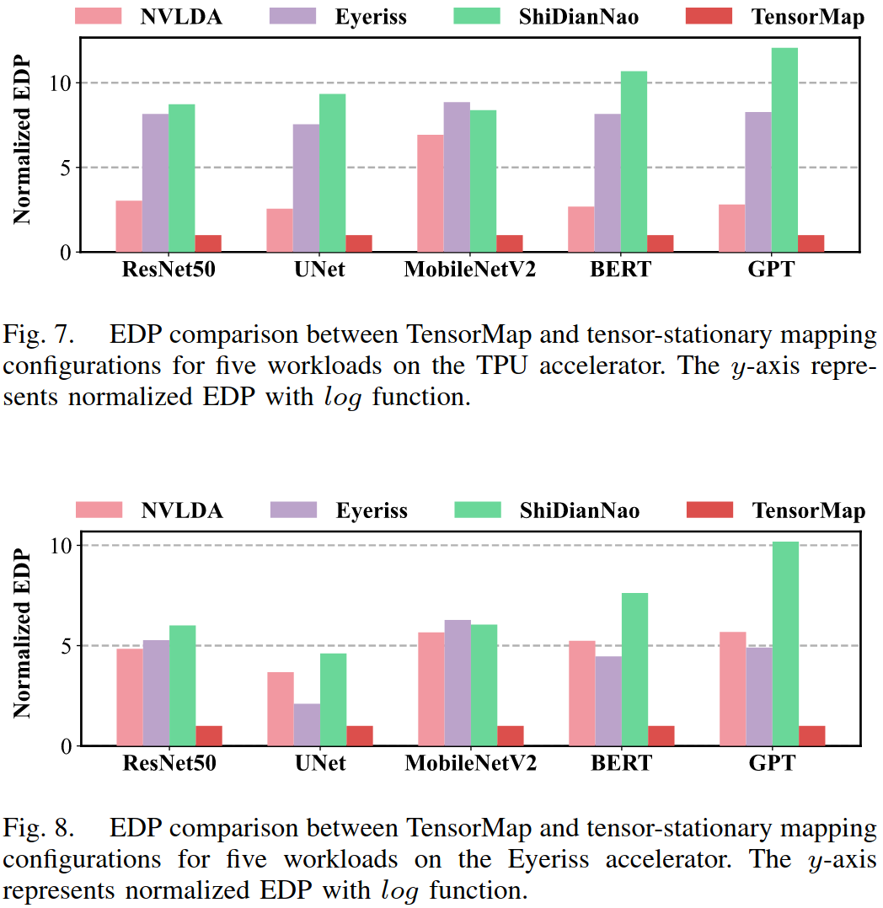
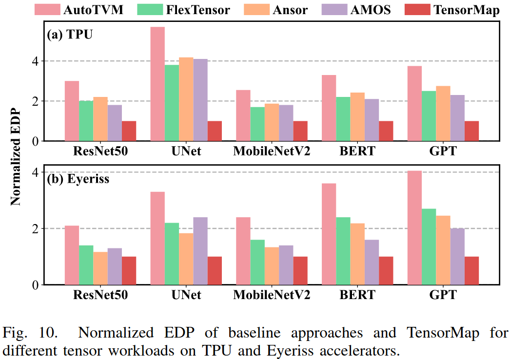
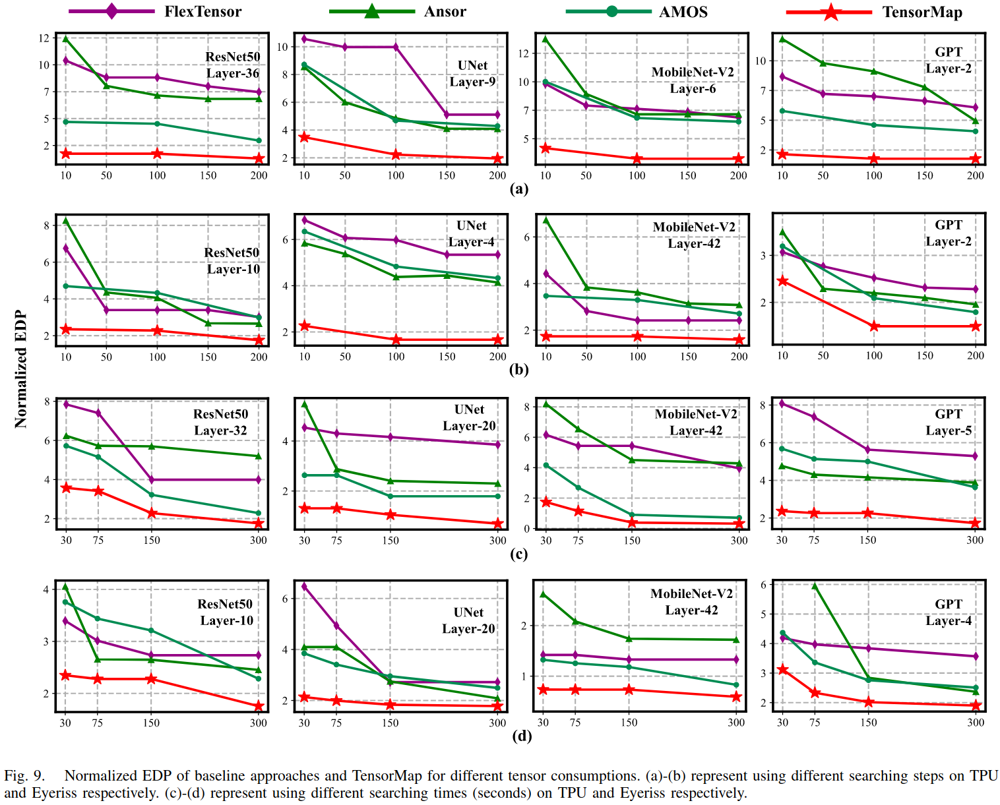
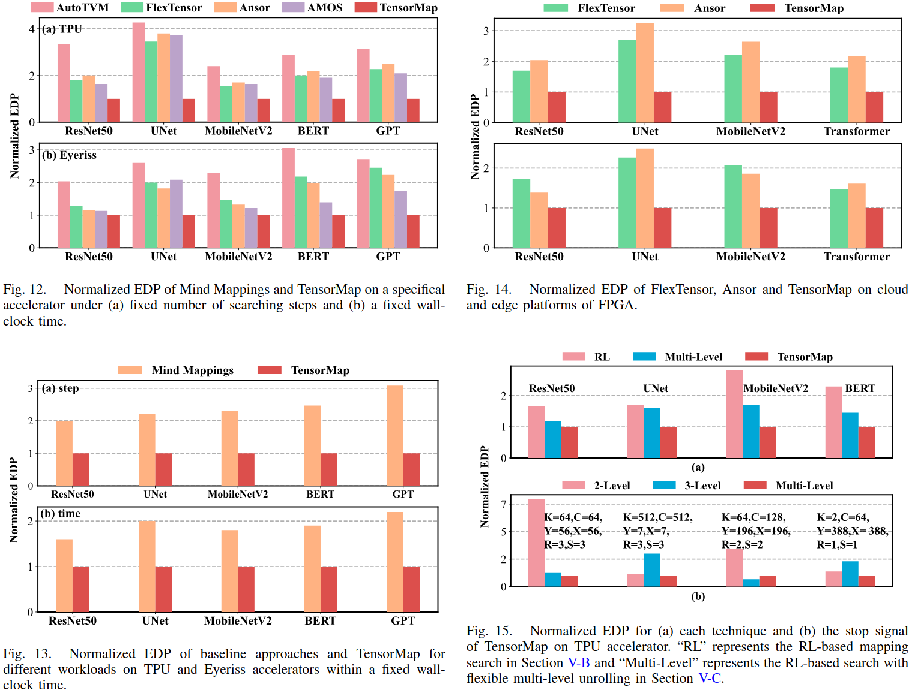

### Motivation
之前的方法在搜索空间都是并发探索每个原语，没有考虑原语之间的关系；基于预定义的模板定义一个静态映射空间，张量计算的循环展开的级数都是固定的

### TensorMap

***overview***

***RL-Based Mapping Search***

***Multi-Level Unrolling***

***GA-Based Refinement***

### Evaluation

### Reference
[TensorMap: A Deep RL-Based Tensor Mapping Framework for Spatial Accelerators](https://ieeexplore.ieee.org/stamp/stamp.jsp?tp=&arnumber=10527402)