### Motivation
利用图转换进行内存优化的两大挑战：
1. F-Trans引入的复杂度
2. 相关图转换和图调度

### Design

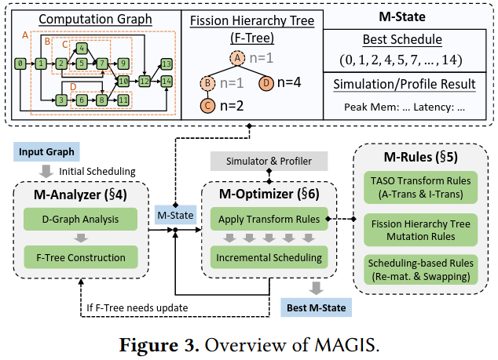

***M-Anlayzer***

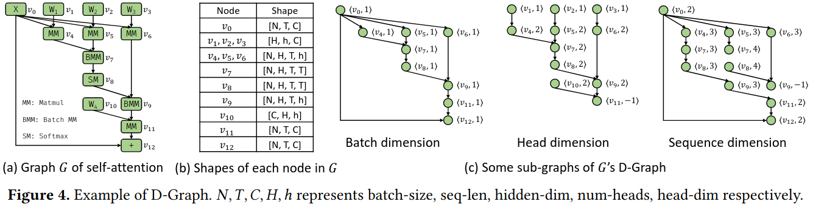

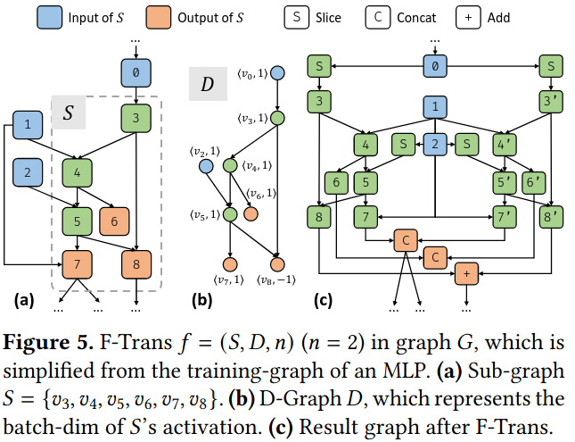

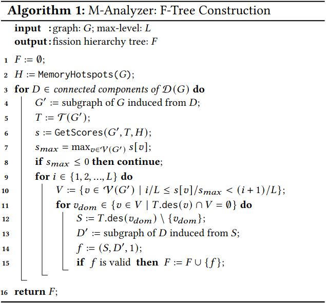

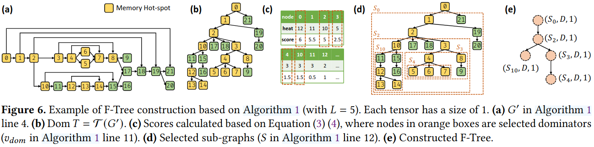

***M-Rules***

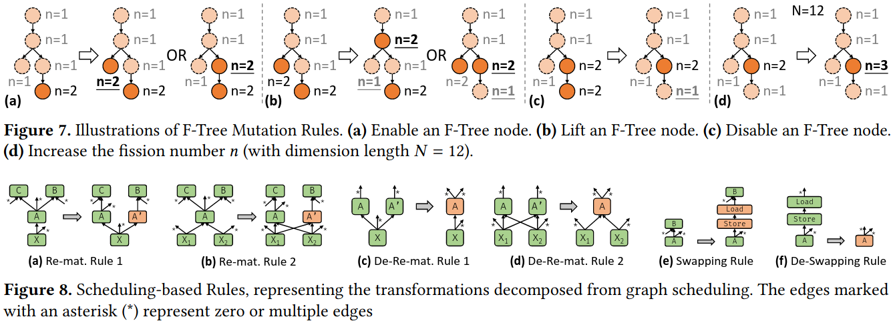

***M-Optimizer***

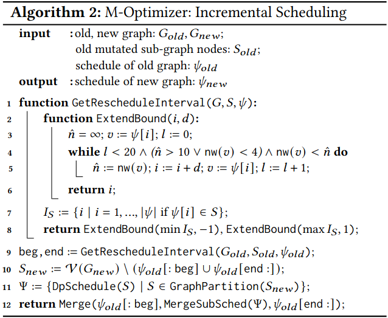

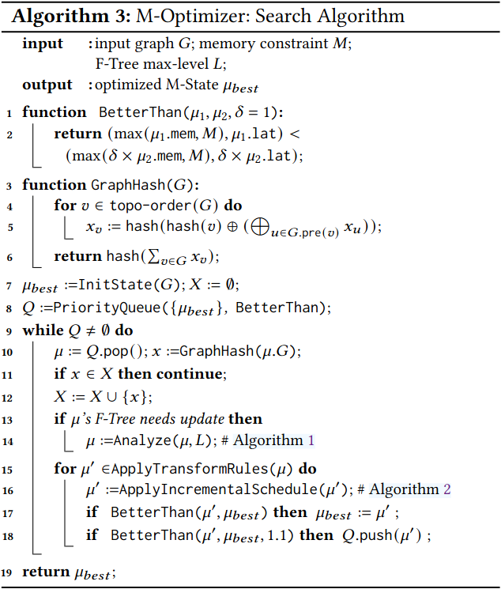

### Evaluation

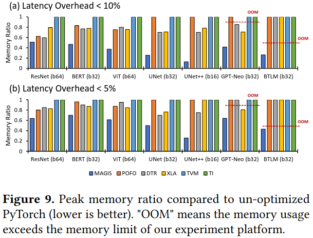

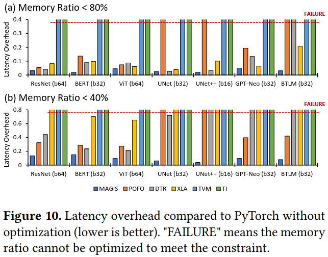

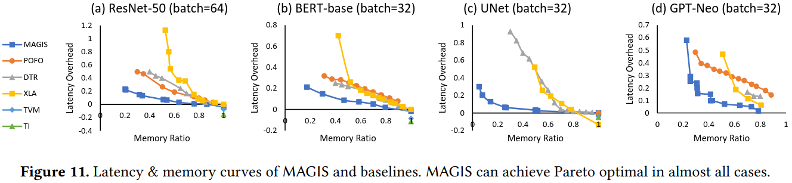

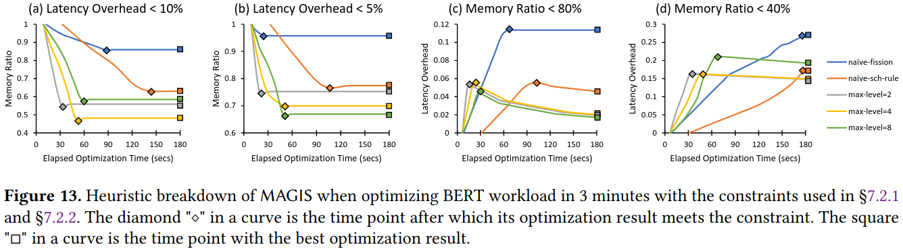

### Reference
[MAGIS: Memory Optimization via Coordinated Graph Transformation and Scheduling for DNN](https://dl.acm.org/doi/pdf/10.1145/3620666.3651330)