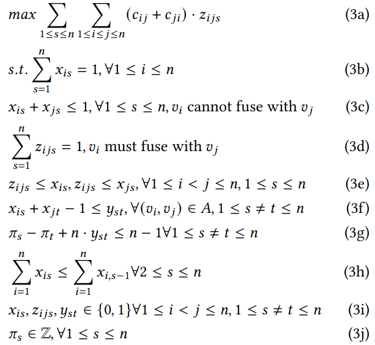
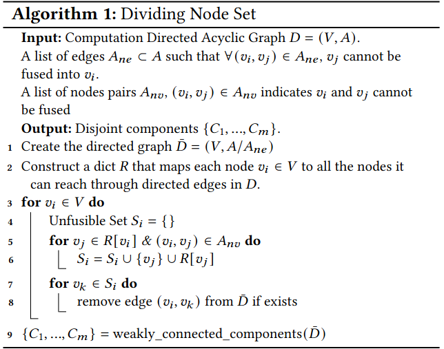
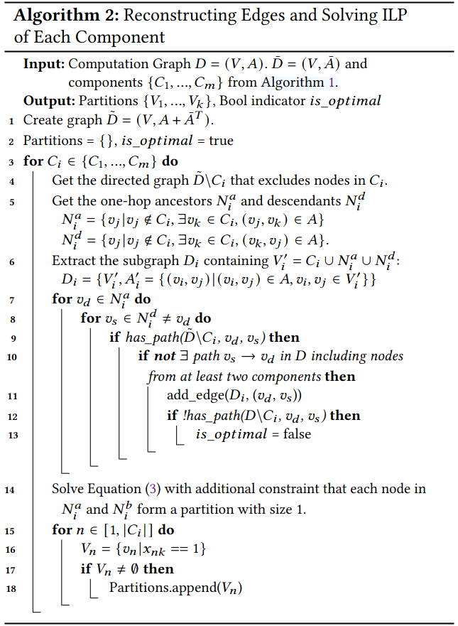
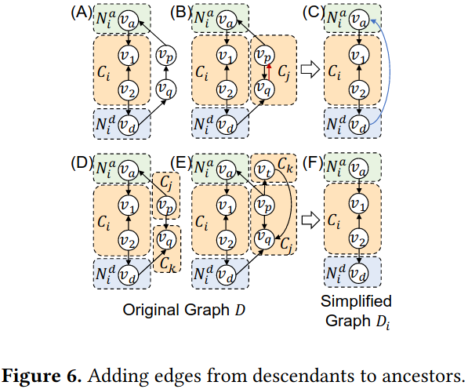
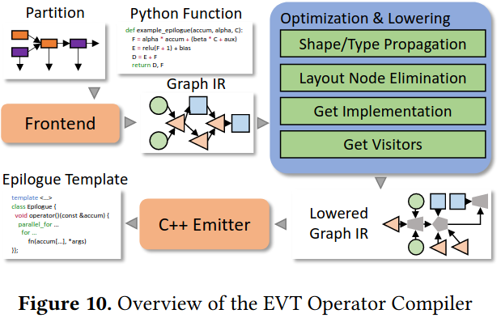
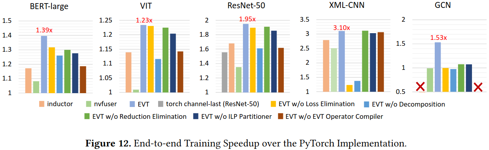

### Challenges
在优化神经网络模型训练，进行编译优化所遇到的挑战
1. 现有算子编译器不能生成融合库能充分发挥性能同时适应各种各样的融合模式
2. 现有方法主要关注前向和后向优化，很少关注损失函数
3. 分割算法不能找到合适和最优的分割图

### Design

**Graph-level Optimizations** 
损失消除： 在反向传输计算不需要计算损失值；只要当用户需要分析训练过程的时候损失值才计算 
分解 
规约消除

**Partitioner** 
整数线性编程问题

解决上面ILP问题会导致O(n^3)个决策变量，提出两步解决方法：
1. 将V个节点集分割不联合成分{C1,...,Cm}
2. 重建每个成本的边确保解决方案的有效性

**Operator-level Optimization**

### Evaluation
benchmark: BERT-Large、VIT、ResNet-50、XML-CNN、GCN 
baseline: Torch Inductor、NVFuser

### Reference
[EVT: Accelerating Deep Learning Training with Epilogue Visitor Tree](https://dl.acm.org/doi/pdf/10.1145/3620666.3651369)
