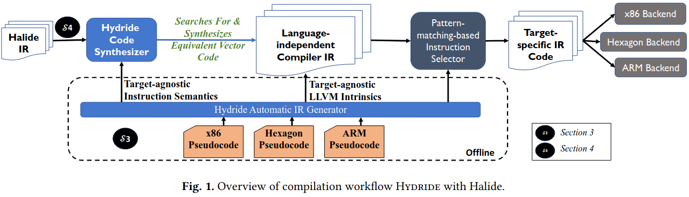
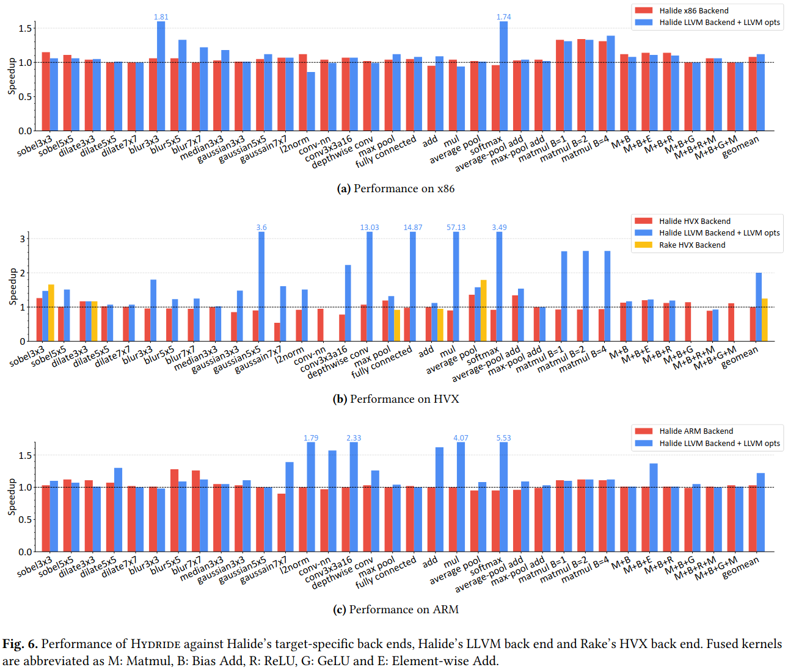
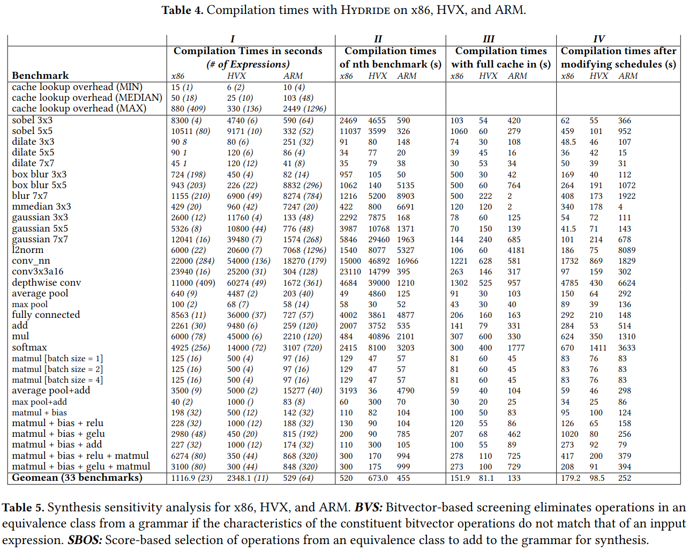

### Challenges
目标独立的编译器IR没有扩展机制来添加新指令

### Design

### Evaluation

### Reference
[Hydride: A Retargetable and Extensible Synthesis-based Compiler for Modern Hardware Architectures](https://dl.acm.org/doi/pdf/10.1145/3620665.3640385)

