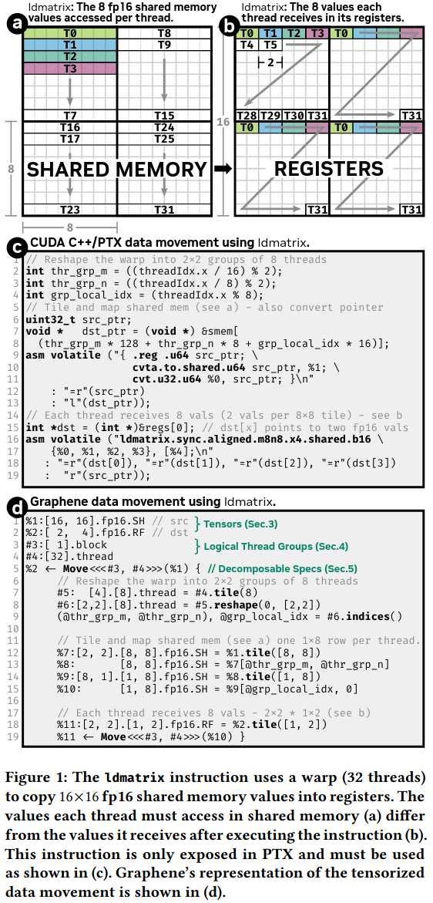
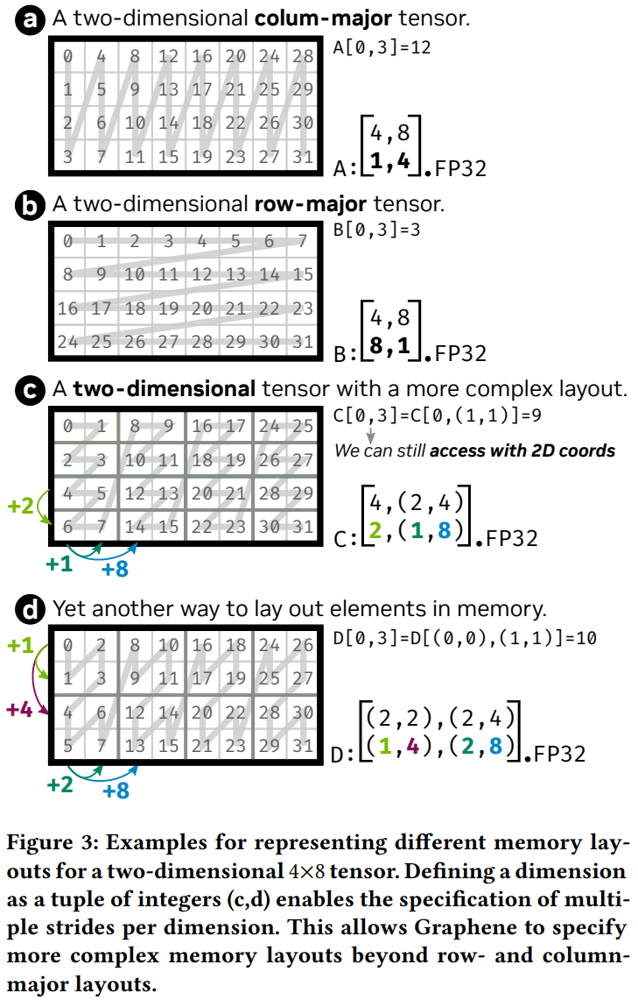
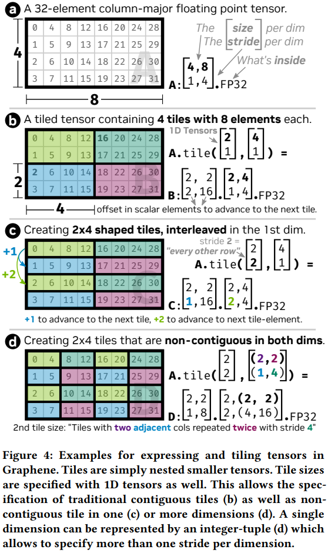
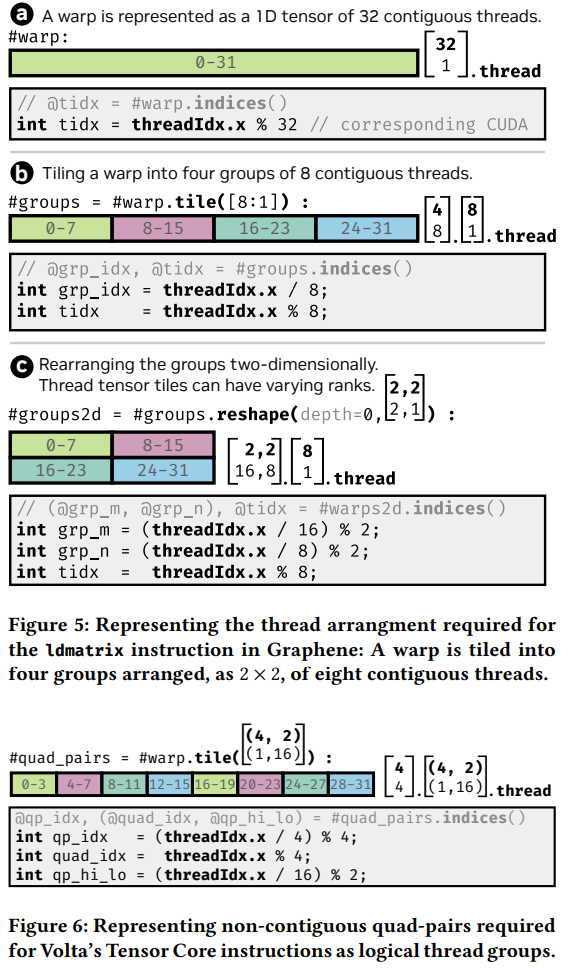
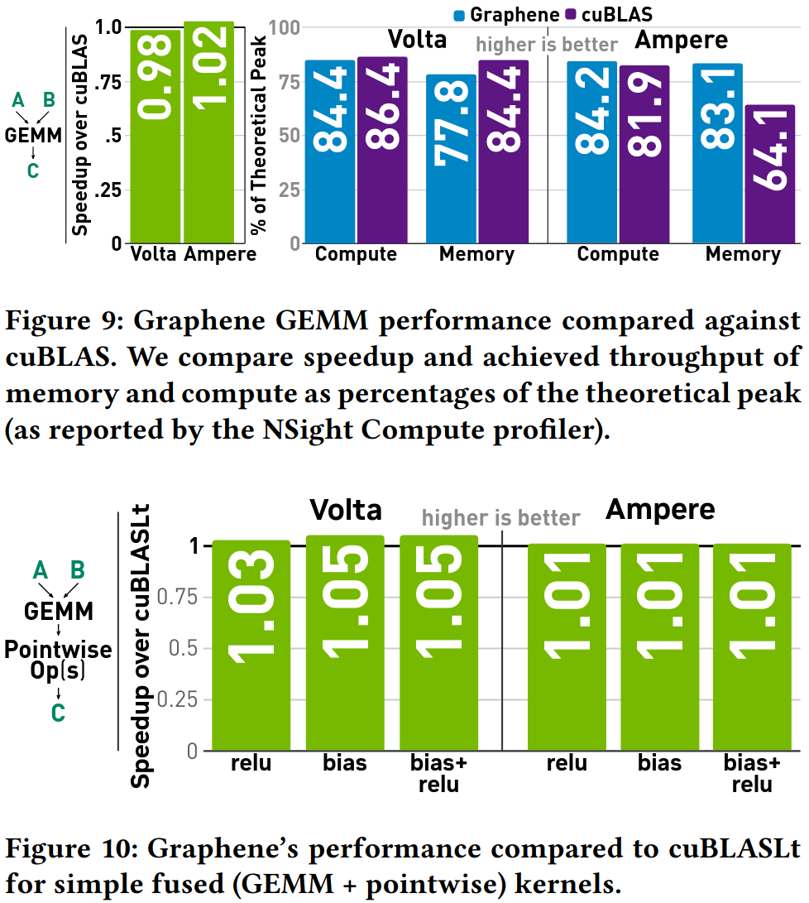
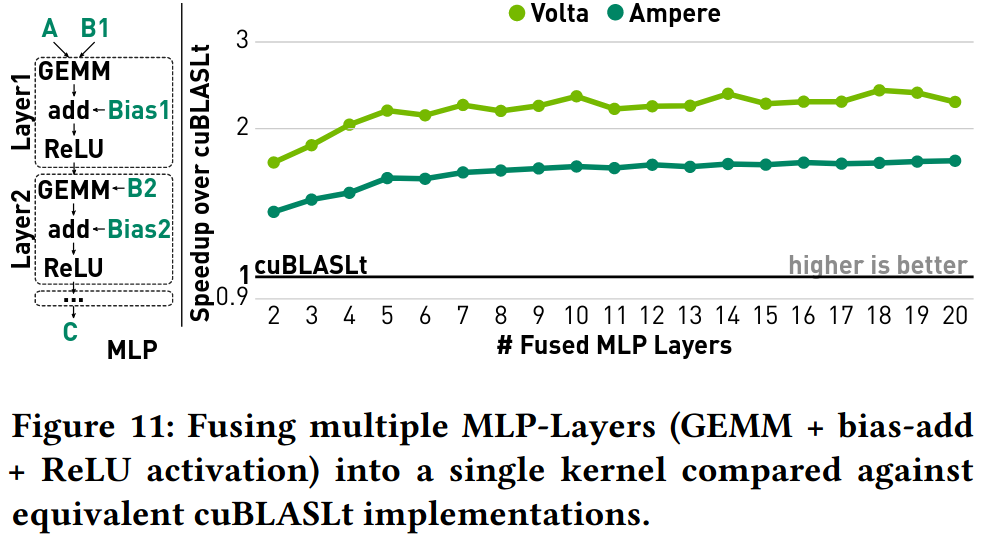
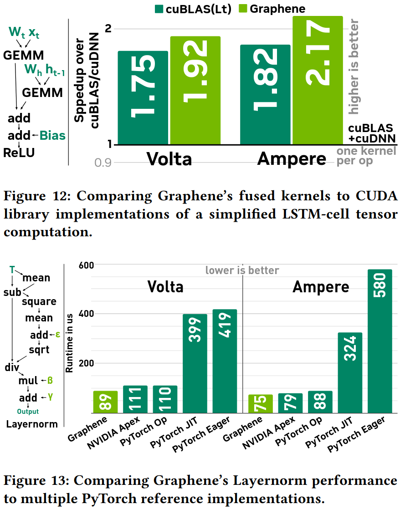
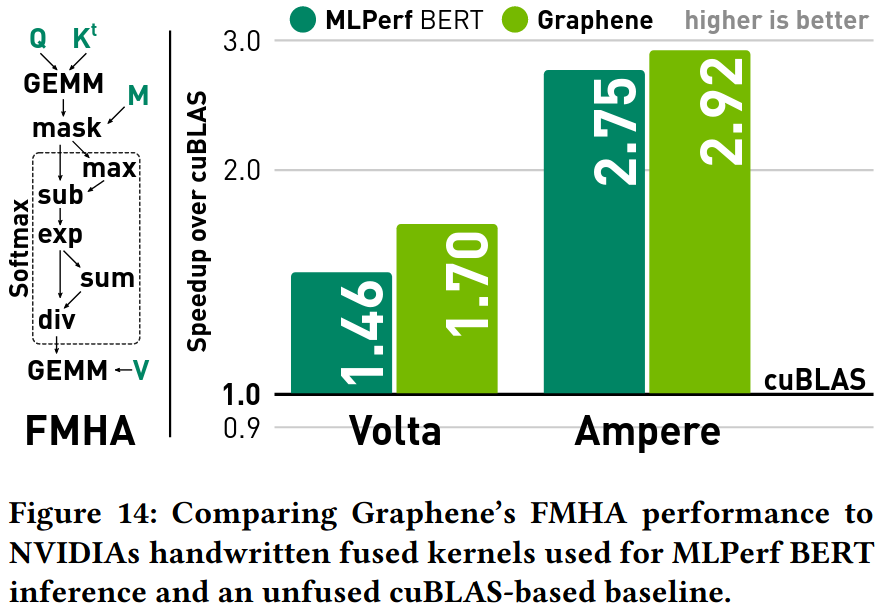
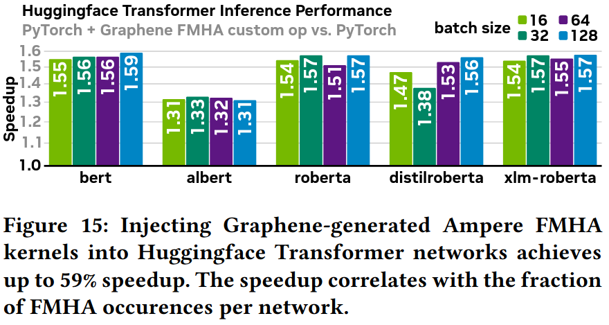

### Optimized GPU data movements

### Graphene中的张量语法
Tensor = Name : Shape . ElementType . Memory (张量名称: 形状描述 元素类型 内存位置)  
shape = [Dims : Stride] 维度和步长  
ElementTYpe = ScalaerType | Shape . ElementType

列主序  
4行8列  
步长[1,4]: 列内相邻元素步长1,行间步长4  

行主序  
4行8列  
步长[8, 1]: 行间步长8,行内相邻元素步长1  

复杂层次化布局  
C: [4, (2, 4)] : [2, (1, 8)]  
第一维: 4个元素,步长2  
第二维: (2, 4)表示“2个相邻元素，重复4次”  
对应步长: (1, 8)表示“相邻元素步长1，重复组间步长8”  

张量分块: GPU有多层存储层次(全局内存→共享内存→寄存器)，需要将大张量分解成小块，映射到不同层次，每个层次处理合适大小的数据块

规则分块
B: [2, 2].[2, 4].fp32
[2, 2]: 外层形状，表示有2*2=4个块
[2, 4]: 内层形状，表示每个块是2*4大小

### Logical thread groups

线程作为张量  
线程张量语法 = Name : Shape . thread/block  
与数据张量的区别:  
数据张量: %tensor_name  
线程张量: #thread_name  
没有memory标签(线程不存储在特定内存中)  

### Specifications and decompositions

specification: 封装一个自包含的计算块(可以是设备级矩阵乘法kernel，也可以是warp级数据移动)
atomic specification: 不需要进一步分解，直接映射到GPU指令，包含精确的线程要求和张量形状
generic specification: 没有预定义的语义，完全由其分解来定义功能，可以表达任意复杂的融合计算

### Evaluation

### Summary
核心问题
* GPU硬件与软件表示的巨大鸿沟
硬件现状(现代GPU提供强大的张量指令，硬件可以直接操作多维张量，一条指令可以完成复杂的张量操作)
软件现状(程序员仍然要用一维内存缓冲区和标量线程索引来编程，没有张量抽象，复杂的张量操作要用大量底层代码来实现)
* 现有张量编译器的表达能力不足
依赖库函数、高级内置操作(无法表达复杂的数据-线程映射)、复杂编译器变换

### Reference
[Graphene: An IR for Optimized Tensor Computations on GPUs](https://dl.acm.org/doi/pdf/10.1145/3582016.3582018)