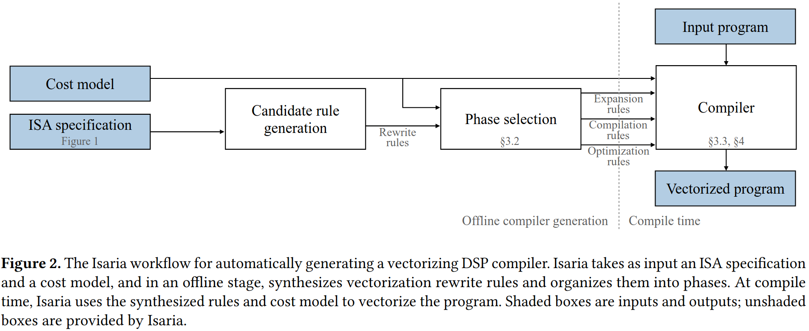
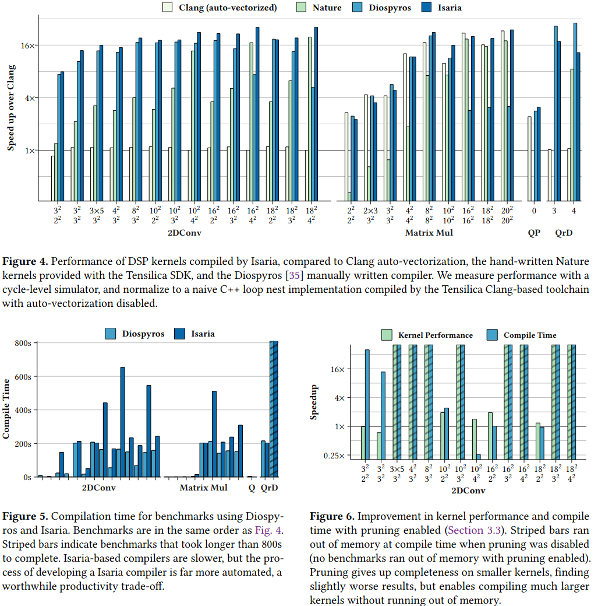
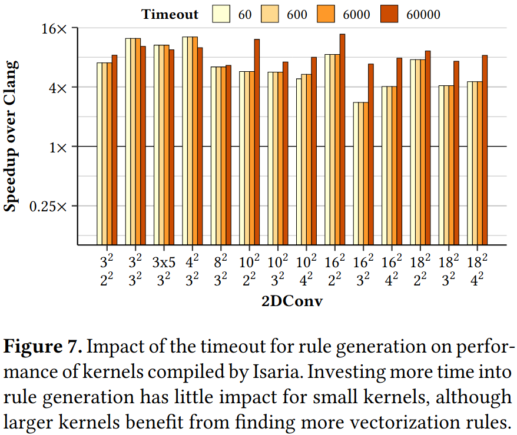

### Motivation
定制高效重写规则是一个十分精致平衡操作，容易陷入局部最优
重写规则对于编译器来说必须是正确的
重写队则必须对应于指令集

### Design

**Phase-oriented rule synthesis**

### Evaluation

### Reference
[Automatic Generation of Vectorizing Compilers for Customizable Digital Signal Processors](https://dl.acm.org/doi/pdf/10.1145/3617232.3624873)