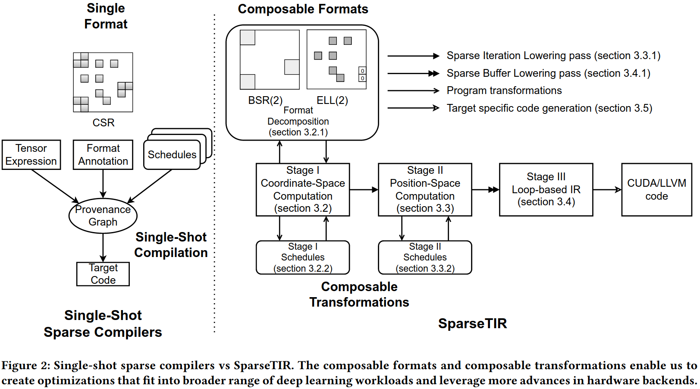
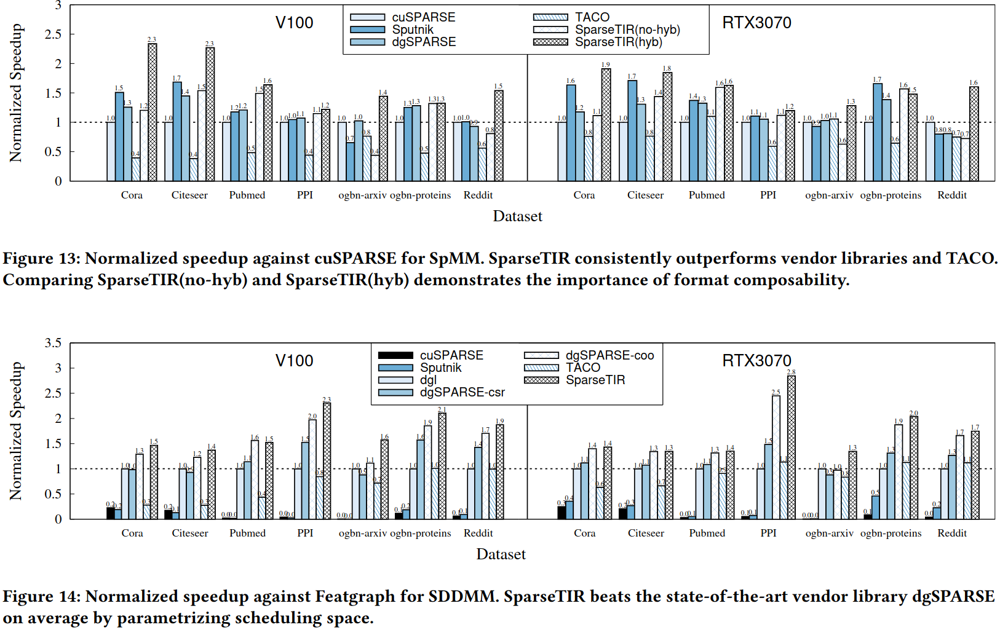
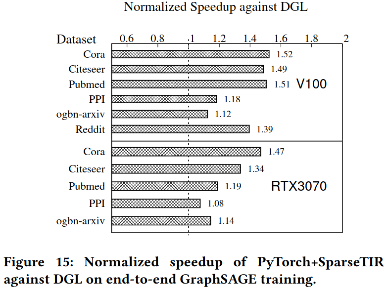
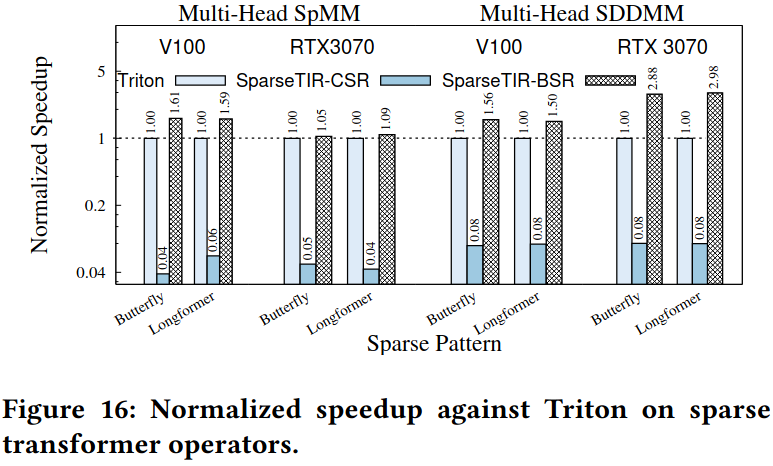
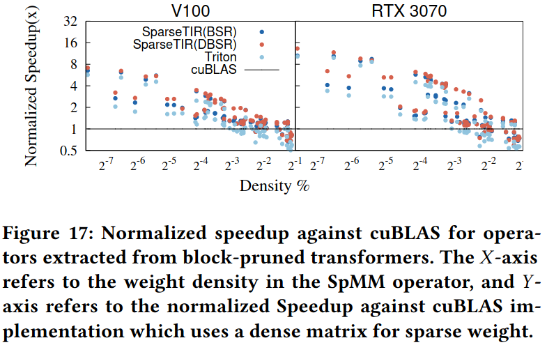
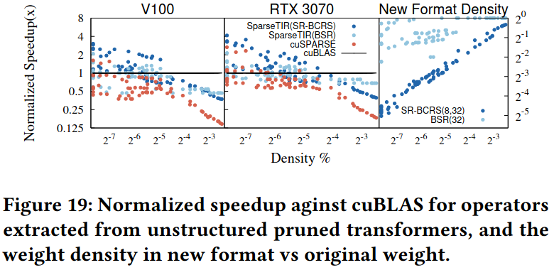
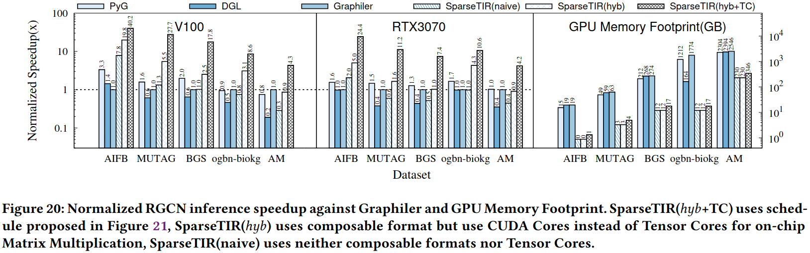

### Design

***Language Constructs***

***Stage I: Coordinate Space Computation***

***Stage II: Position Space Computation***

***Stage III: Loop-Level IR***

### Evaluation

### Reference
[SparseTIR: Composable Abstractions for Sparse Compilation in Deep Learning](https://arxiv.org/pdf/2207.04606)