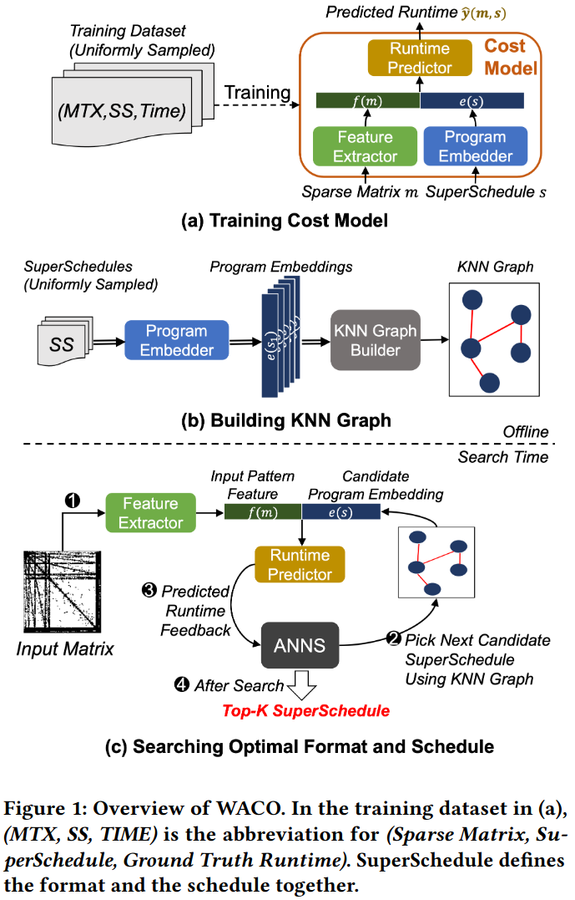
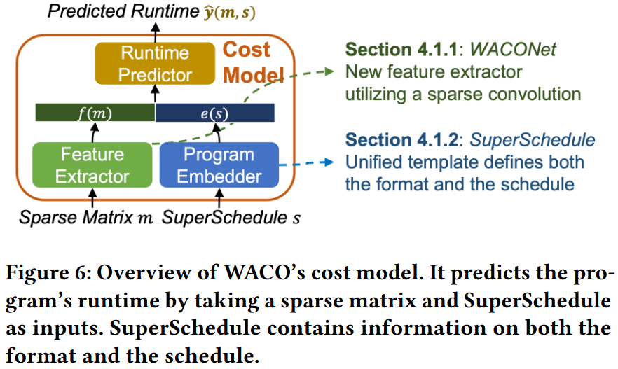
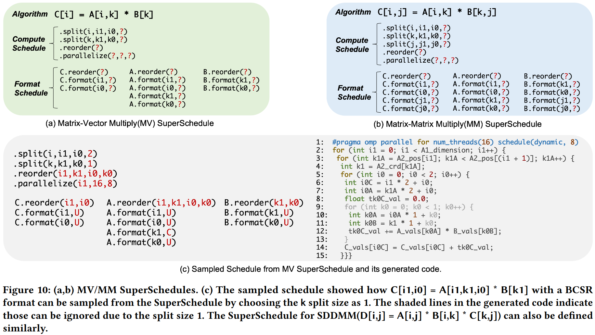
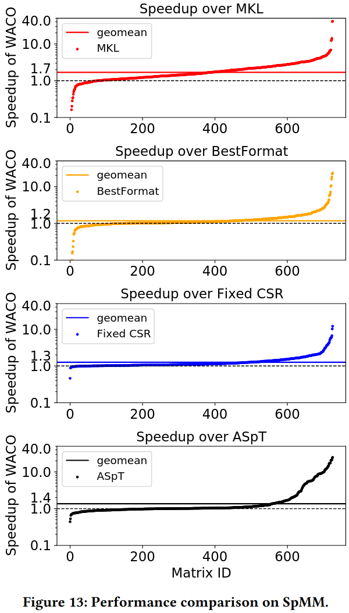
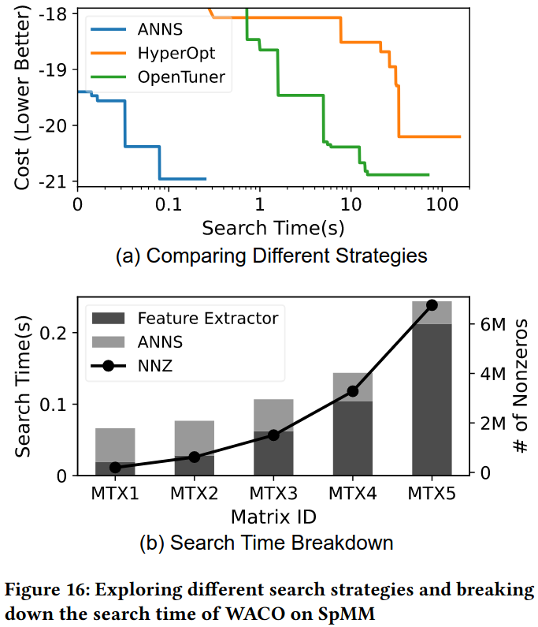
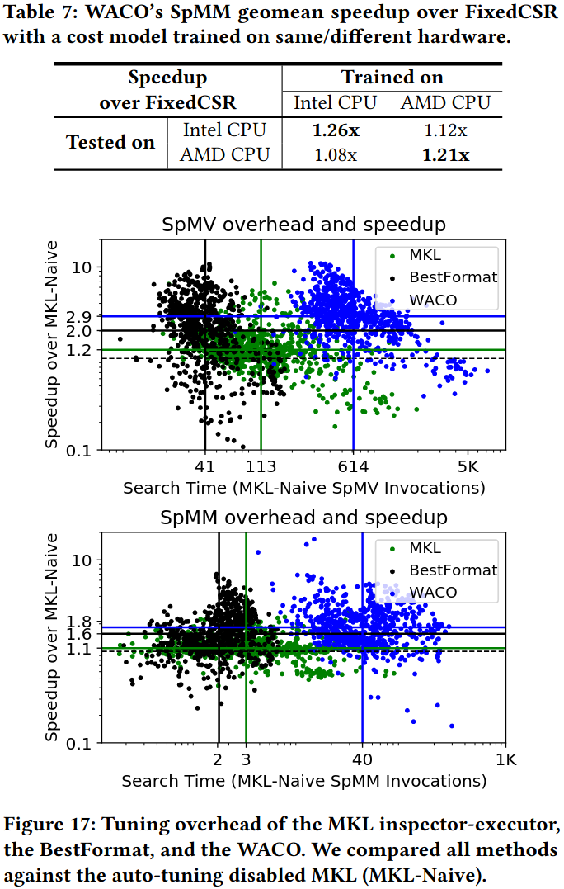

### Motivation
现有的稀疏计算的自动调优有如下局限
1. 捕捉稀疏模式的有限
2. 缺少协同优化

### Workload-aware co-optimization
**Cost Model Design** 

- feature extractor: WACONet(1. Exloring Different Architectures 2. Sparse Convolutional Layer 3. WACONet)
- Program Embedded: SuperSchedule
- Training Cost Model

**Efficient Schedule Search via Nearest Neighbor Search** 

### Evaluation

### Reference
[WACO: Learning Workload-Aware Co-optimization of the Format and Schedule of a Sparse Tensor Program](https://dl.acm.org/doi/pdf/10.1145/3575693.3575742)