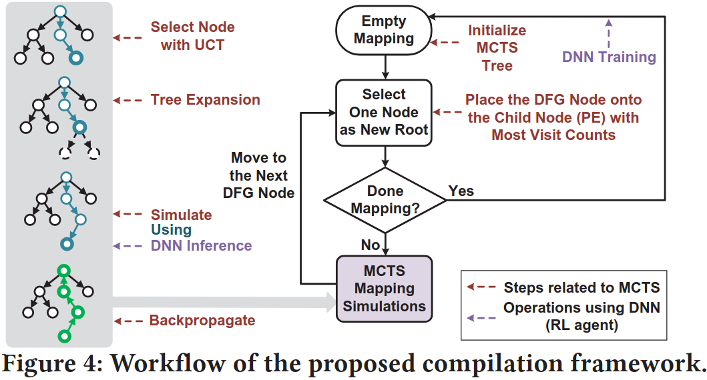
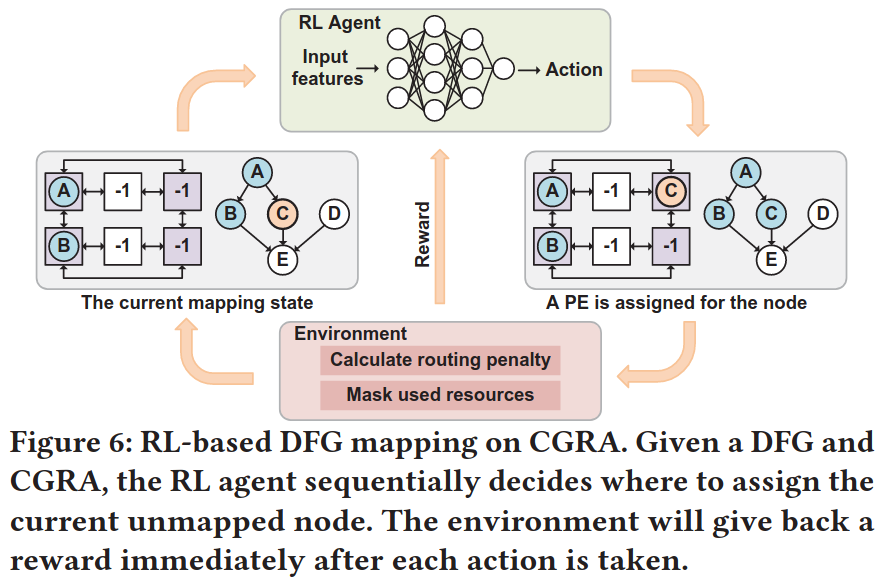
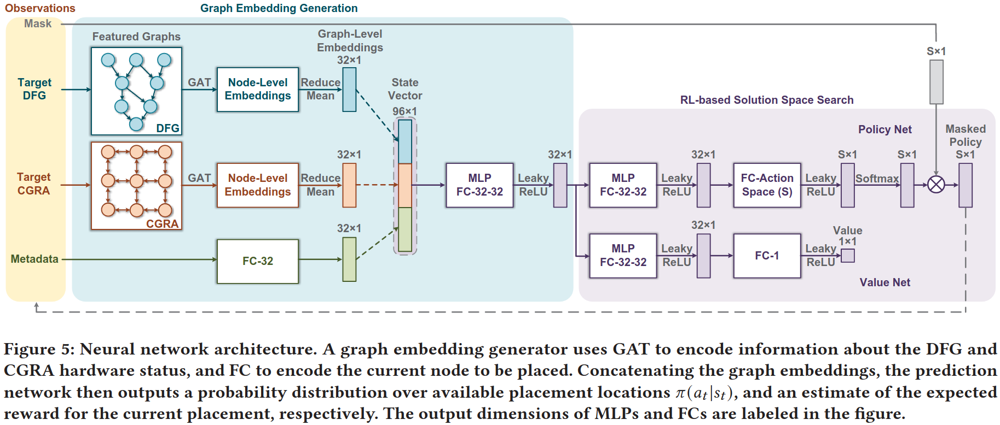
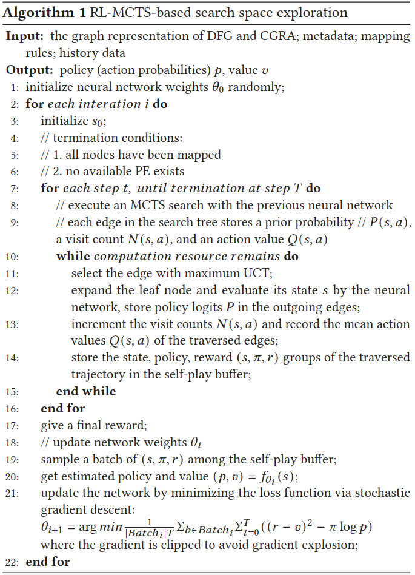
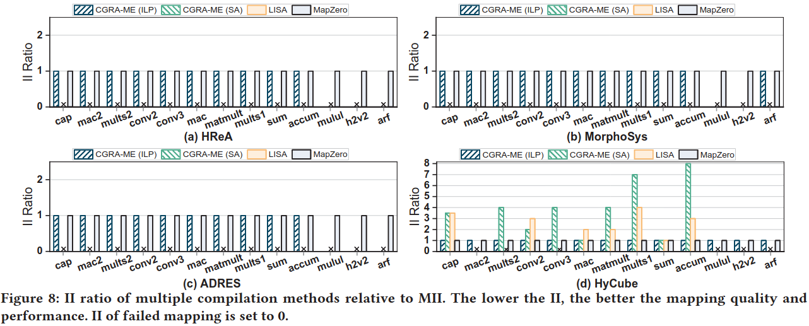
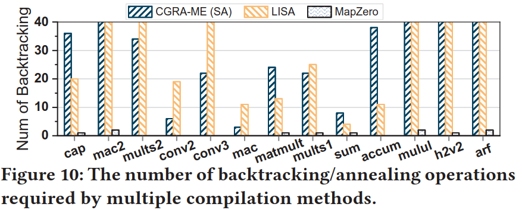
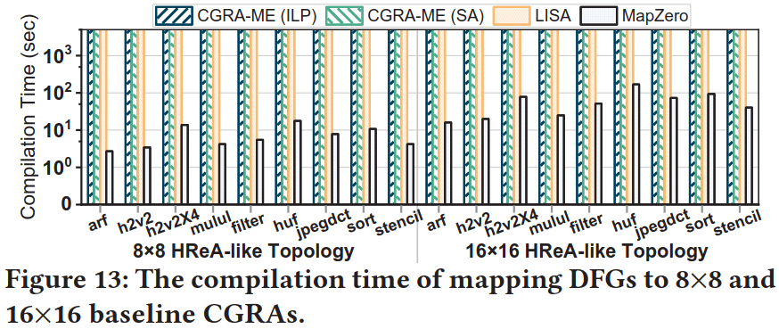

### Challenges
1. 搜索空间复杂

### Design

**Graph Embedding Generation**

**RL Problem Formulation**

**Neural Network Structure**

**Search Space Exploration**

**Training Strategy**

### Evaluation

### Reference
[MapZero: Mapping for Coarse-grained Reconfigurable Architectures with Reinforcement Learning and Monte-Carlo Tree Search](https://dl.acm.org/doi/pdf/10.1145/3579371.3589081)
