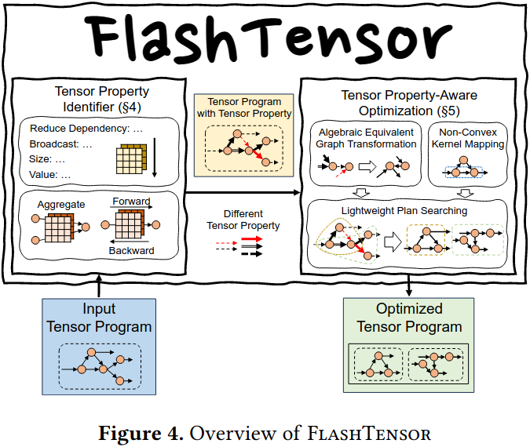

### Motivation
在长文本场景里面会产生极度大的中间变量会导致大量内存开销

### System Overview

**Tensor Property Identifier**
Property Definition
reduce dependency： NonPara、Reuse、Batch
broadcast
size
value

Dataflow-Based Property Identification
Property Propagation
Property Aggregation

**Tensor Property-Aware Optimization**
