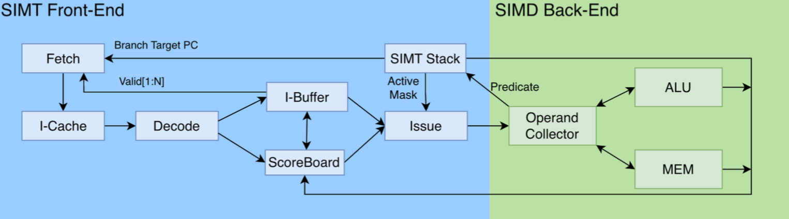
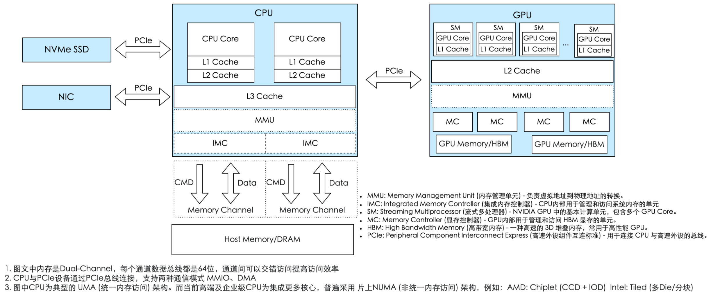
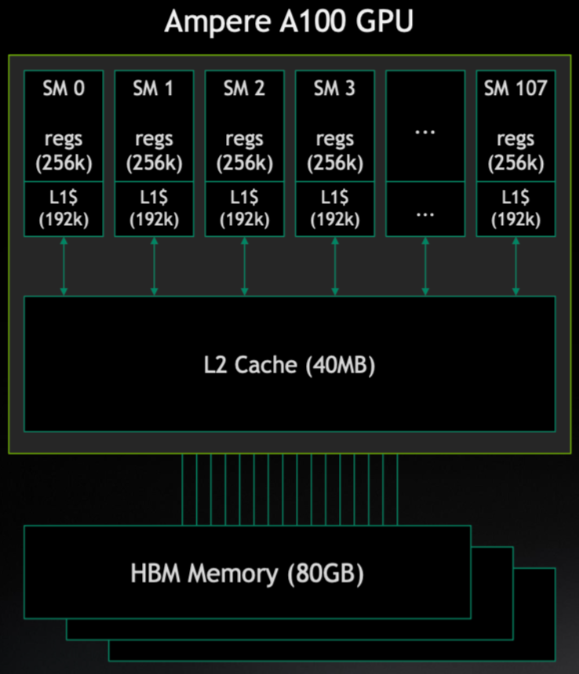
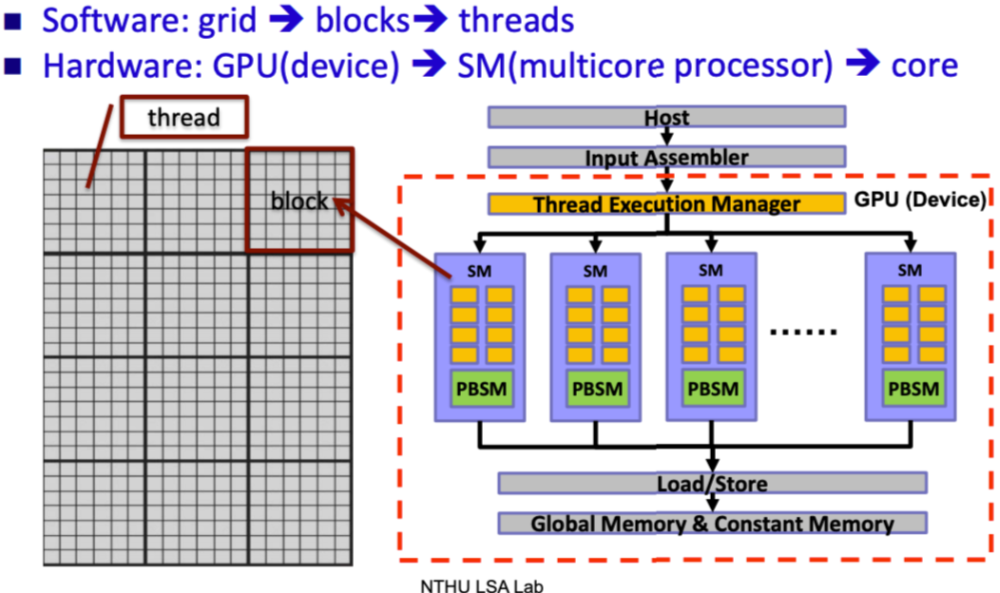
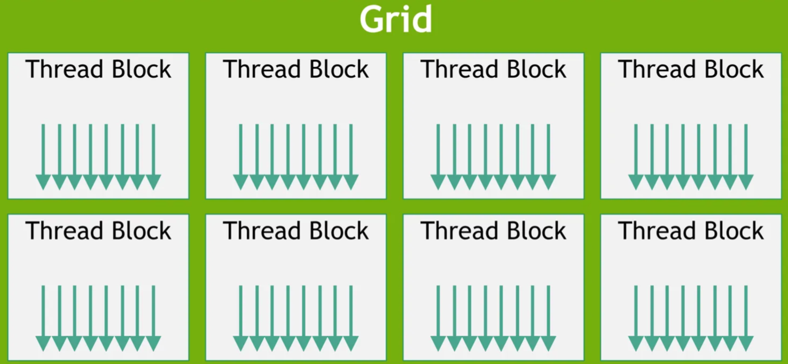
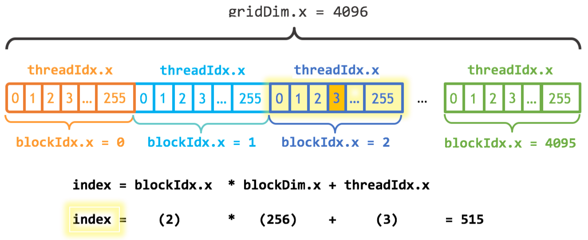
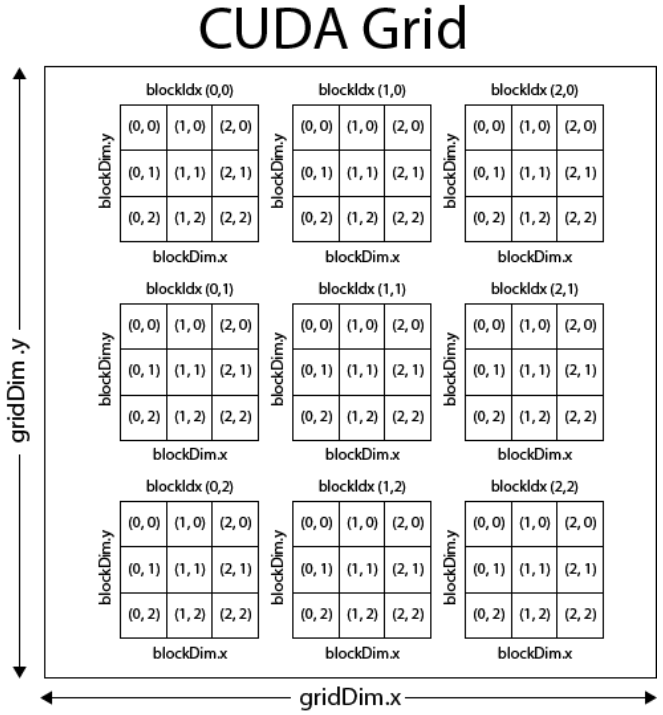
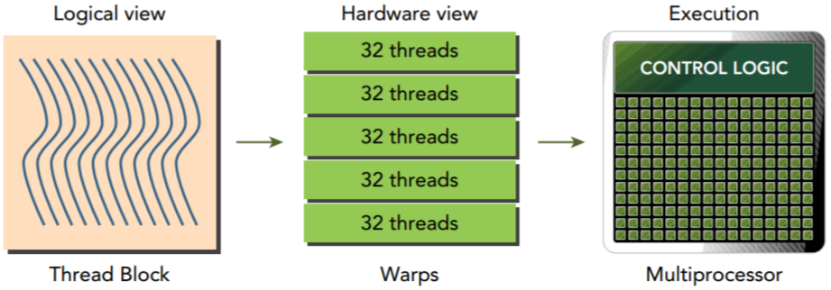
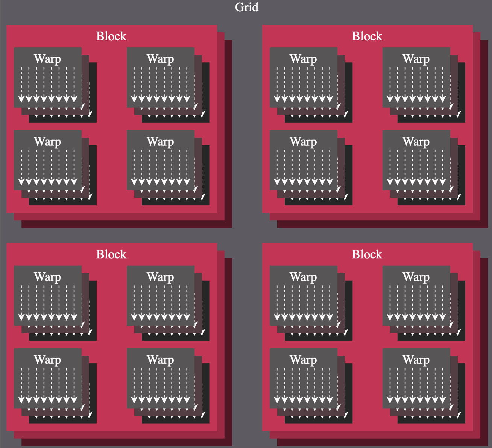

# GPU编程
**设备侧和主机侧**

GPU编程的思维是将GPU当做CPU的协同外设使用，通过GPU自身无法独立运行，需要CPU指定任务，分配数据，驱动运行，CPU称为主机侧，而GPU称为设备侧

**线程组织**


线程(thread): 最基本的执行单元，线程包含独立寄存器状态和独立程序计数器 <br>
线程块(thread block): 由多个线程组成的集合，支持一维、二维或三维结构。线程块内的线程可以通过共享内存进行通信，线程块之间无法通过共享内存通信，但可通过全局内存进行数据交互 <br>
线程束(Warp): 硬件底层概念，CPU实际运行时将32个线程组成一个warp，同一warp内的线程同步执行相同的指令 <br>
线程块与warp的关系： warp是底层概念，NVIDIA的warp固定包含32个线程，warp是线程硬件调度的最小粒度，线程块是软件概念，线程块有多少个线程组成由代码指定。在运行时，硬件会将线程块中的线程32个为一组打包成多个warp进行调度，线程块里的线程数最好为32的整数倍，以避免为拼凑完整warp而自动分配无效线程造成资源浪费 <br>
网格(grid): 网格是所有线程块的集合，支持一维、二维或三维结构，覆盖整个计算任务的运行范围 <br>
SM(Streaming Multiprocessor): GPU并行计算的核心，管理Block的执行，负责执行一个或多个Block<br>
Warp Scheduler(线程束调度器): SM中的一个组件，负责调度和执行warp，它从分配给SM的Block中选择可执行的warp，并将指令分发给warp中的线程，每个scheduler可以管理多个warp<br>


|NVIDIA(CUDA) | AMD(OpenGL)|
|:---: | :---:|
|Grid | NDRange|
|Thread Block | Work Group|
|Warp | Wavefront|
|Thread | Work Item|

区别于NIVIDIA， AMD的一个wavefront由64个work item组成，线程块有时也被称为CTA

**线程块的计算**
一个线程块由多少个线程组成可以指定，与此不同的是，线程块本身的数量则是由计算规模决定的
B = (N + T - 1) / T  [B: 线程块数， N: 问题规模, T: 线程块内线程数]

**指定线程执行内核函数指令**
```
__global__ void saxpy(int n, float a, float *x, float *y) {
    int i = blockIdx.x * blockDim.x + threadIdx.x;
    if (i < n) {
        y[i] = a * x[i] + y[i];
    }
}
```
每个线程分配一个其所属的向量元素，然后驱动线程分别完成计算
i为线程的编号，blockIdx是block在grid的坐标，blockDim则是block本身的尺寸threadIdx为thread在block上的坐标

在二维的grid和block设置中，thread ID 和block ID首先由x方向递增，再以y方向递增，因此全局线程ID计算方式如下：
threadIdx.x + threadIdx.y * blockDim.x + blockIdx.x * (blockDim.x * blockDim.y)


**多维线程组织结构**

```
// 主机端调用代码
void launch_kernel_3d() {
    // 三维数据尺寸
    int dimX = 64    int dimY = 32    int dimZ = 16;
    // 定义三维线程块（Block）和网格（Grid）
    dim3 blockSize(8, 4, 4);  // 指定每个块包含8x4x4=128个线程
    dim3 gridSize(
        (dimX + blockSize.x - 1) / blockSize.x, // X方向块数
        (dimY + blockSize.y - 1) / blockSize.y, // Y方向块数
        (dimZ + blockSize.z - 1) / blockSize.z  // Z方向块数
    );
    // 启动内核函数
    kernel_3d<<<gridSize, blockSize>>>(d_data, dimX, dimY, dimZ);
}
```

```
// 核函数定义（处理三维数据）
__global__ void kernel_3d(float* data, int dimX, int dimY, int dimZ) {
    // 计算三维索引
    int x = blockIdx.x * blockDim.x + threadIdx.x;
    int y = blockIdx.y * blockDim.y + threadIdx.y;
    int z = blockIdx.z * blockDim.z + threadIdx.z;

    if (x < dimX && y < dimY && z < dimZ) {
        // 处理三维数据（例如：三维矩阵元素操作）
        int idx = x + y * dimX + z * dimX * dimY; // 线程编号
        data[idx] *= 2.0f; // 示例：每个元素翻倍
    }
}
```

**SIMT**
SIMT: 通过统一指令只会多个线程并行处理不同数据
SIMD: 在同一时刻向多个数据元素执行同样的一条指令，SIMD范式常见的一种实现是CPU的向量化运算，将N份数据存储在向量寄存器里，执行一条指令，同时作用于向量寄存器里的每个数据 指令+操作数 -> 结果


**指令集与编译**
SASS是GPU的机器指令集
PTX是一种中间表示形式位于高级GPU编程语言和低级机器指令集之间，PTX与GPU架构基本无耦合关系，本质上是从SASS上抽象出来的一种更上层的软件编程模型


# SIMT核心架构



SIMT前端: 负责指令的获取、译码和发射、分支预测、以及线程的管理和调度
SIMD后端: 负责完成计算

**最小可用系统**


最简GPU可以做到最简的指令执行功能: 即顺序执行每一条指令，一条指令执行完再执行下一条 <br>
Fetch: 取指令 <br>
Decode: 指令解码 <br>
SIMT Stack: SIMT堆栈，管理线程束的分支执行状态 <br>
Issue: 指令发射 <br>
ALU: 算数逻辑单元，代表执行计算的组件 <br>
MEM: 存储器访问单元，代表对L1 Cache、共享内存等各层级内存访问的管理 <br>


**动态指令调度以提高并发**


**提高并发指令的数据供给效率**


# GPU内存模型
**CUDA内存模型**

寄存器、共享内存、本地内存、常量内存、纹理内存、全局内存


每个线程都有自己的私有的本地内存；线程块有自己的共享内存，对线程块内的所有线程可见；所有线程都能访问读取常量内存和纹理内存，但不能写 <br>

寄存器: 在GPU内核函数内不加修饰声明一个变量，此变量就存储在寄存器中；在CPU内只有当前在计算的变量存储在寄存器中，其余在主存中，使用时传输至寄存器 <br>
本地内存: 核函数中符合存储在寄存器中但不能进入被核函数分配的寄存器空间中的变量存储在本地内存中 <br>
全局内存: 全局内存访问是对齐，也就是一次要读取指定大小(32, 64, 128)整数倍字节的内存，所以当线程束执行内存加载/存储时，需要满足的传输数量通常取决于两个因素(1. 跨线程的内存地址分布 2. 内存事务的对齐方式)


**内存管理**
内存分配和释放: cudaMalloc、cudaMemset、cudaFree
内存传输: cudaMemcpy
统一虚拟寻址、统一内存寻址


**内存访问模式**

核函数运行时需要从全局内存中读取数据，只有两种粒度: 128字节、32字节 <br>
对齐内存访问、合并内存访问 <br>
一次内存请求--也就是从内核函数发起请求，到硬件响应返回数据这个过程称为一个内存事务 <br>
一个内存事务的首个访问地址是缓存粒度的偶数倍的时候称之为对齐内存访问，非对齐访问就是除上述的其他情况，非对齐的内存访问会造成带宽浪费 <br>
当一个线程束内的线程访问的内存都在一个内存块里的时候，就会出现合并访问


**共享内存**
每个线程对共享内存的访问请求:
1. 最好的情况是当前线程束中的每个线程都访问一个不冲突的共享内存，这种情况，大家互不干扰，一个事务完成整个线程束的访问，效率最高
2. 当有访问冲突的时候，这时候一个线程束32个线程，需要32个事务
3. 如果线程束内32个线程访问同一个地址，那么一个线程访问完后以广播的形式告诉大家

共享内存有个特殊的形式是，分为32个同样大小的内存模型，称为存储体，可以同时访问，32个存储体的目的是对应一个线程束中有32个线程，这些线程在访问共享内存的时候，如果都访问不同存储体(无冲突)，那么一个事务就能够完成，否则需要多个内存事务，这样带宽利用率降低<br>
线程束访问共享内存
1. 并行访问，多地址访问多存储体
2. 串行访问，多地址访问同一存储体
3. 广播访问，单一地址读取单一存储体

NV芯片的shared memory是由32个bank组成的，每个bank的宽度是32bit. 在shared memory上的数据布局中，连续地址的数据被放在相邻的bank上，并且不同的bank可以被同时访问. 如果一个内存请求涉及n个不同bank的n个地址，硬件能够并行处理这些访问，因此访存速度比local memory和global memory更快

不同线程访问同一个bank的不同地址时，触发bank conflict，而当不同线程访问同一个bank的相同地址时，触发广播机制，不会造成bank conflict<br>
如何解决bank conflict?<br>
1. 使用padding方式，在shared memory二维数据的列维度+1
2. 使用swizzle，重新修改数据的布局

row-major or column-major<br>
在memory中，二维矩阵的元素按一维线性地址顺序存储，若相邻内存地址对应矩阵同一行的元素，称为行优先存储；若对应同一列的元素，则称为列优化存储

合并访存<br>
当一个warp中的所有thread同时执行访存指令时，硬件会检查这些线程是否访问了连续的全局内存地址，如果是，硬件会把这些访问合并成一次对连续DRAM地址的统一访问. 假设一个加载指令中，线程0访问全局内存地址N，线程1访问N+1，线程2访问N+2，依次类推，这些访问会被合并成一个对连续地址的单一请求，发送到DRAM，这种合并访问让DRAM能以burst的形式高效传输数据<br>
强调: 合并访存发生在**同一个warp的不同thread之间**，而**不是单个thread在loop中不同iteration之间**. 在访问**global memory和local memory**的地址时，才能触发合并访存. **shared memory的数据访问是不会触发合并访存**


利用合并访存处理矩阵<br>
在cuda编程，利用合并访存优化矩阵访问的核心在于内存访问模式与存储顺序的对齐。对于按行优先存储的M*N矩阵A：
1. 每个线程访问一整行元素(需M个线程)，如图a所示<br>
    a. 线程0负责第0行，访问A[0][0], A[0][1], ..., A[0][N-1]<br>
    b. 线程1负责第1行，访问A[1][0], A[1][1], ..., A[1][N-1]<br>
   相邻线程访问的地址之间相隔了N个元素，由于这些地址不连续，warp中的访存无法合并，导致内存事务分散，效率低下
2. 每个线程访问一整列元素(需N个线程)，如图b所示<br>
    a. 线程0负责第0列，访问A[0][0], A[1][0], ..., A[M-1][0]<br>
    b. 线程1负责第1列，访问A[0][1], A[1][1], ..., A[M-1][1]<br>
   在第k个iteration中，N个线程正好访问A[k][0], A[k][1], ..., A[k][N-1]. 它们在内存中是连续存放的，相邻线程访问的地址之间仅相隔1个元素，这种连续性使得warp中的访存操作可以被合并为一次或少数几次内存事务，完美触发CUDA的合并访存特性

共享内存的数据布局


Wave: GPU在同一时间能够并发执行的所有线程块的集合，由于GPU的SM数量有限，如果启动的Block数量超过GPU能同时处理的数量，就需要分成多个Wave来执行

|GPU型号|SM数量|每SM最大线程数|每SM最大Block数|每Wave最大Block数|
|:---:|:---:|:---:|:---:|:---:|
|V100|80|2048|32|160(Block大小为1024时)|
|A100|108|2048|32|216(Block大小为1024时)|
|RTX 4090|128|2048|32|256(Block大小为1024时)|

优化线程与数据布局的映射方式


当thread.x按列处理结果矩阵C的元素时，多个线程访问矩阵B同一列的相同元素，可触发广播，效率较高，但相邻thread.x在同一迭代中需访问矩阵A的不同行，由于行间元素在内存中不连续，需多次访问，效率较低<br>
当thread.x按行处理结果矩阵C的元素时，多个线程访问矩阵A同一行的相同元素，可触发广播，效率较高，同时相邻thread.x访问矩阵B同一行不同列的元素，内存连续，触发合并访存，效率较高


利用double buffer实现流水线


动机：
在gemm实现中，需要现将数据写入至shared memory中，然后进行计算，这种串行方式降低了执行效率，并且__syncthreads的延时通常很高，使用流水线的方式，同时执行load和compute操作，只要load和compute的数据之间不存在依赖关系，就可以做到overlap

实现方式：
1. 预取操作: 在开始计算前，提前将下一组数据预取到空闲的缓冲区中
2. 在共享内存中分配两块缓冲区(buffer A和buffer B), 分别用于存储当前正在计算的数据和下一轮即将使用的数据
3. 每次迭代时，一个缓冲区提供计算所需的数据，另一个缓冲区异步加载下一组数据


**计算架构**


SM： GPU由多个SM组成，而在SM之外，仅仅有global memory和L2 cache两个组件，gpu sm更类似于CPU的core，不同sm执行不同的指令单元


CPU/GPU异构计算架构
CPU是整个系统的核心，是总指挥，GPU的任务指令是由CPU分配的。<br>
CPU通过PCIe总线给GPU发送指令和数据交互，而PCIe支持DMA和MMIO两种通讯模式 <br>
MIMO(内存映射I/O)由CPU直接控制数据读写，操作系统会把设备地址映射到CPU的虚拟空间中，适合小数据量的指令交互 <br>
DMA(直接内存访问)则允许设备绕过CPU直接访问系统内存，专为大数据块的高效传输设计 <br>
CPU通过IMC和Memory Channel访问内存，为了提升数据传输带宽，高端CPU通常会支持多内存通道，即多IMC和Memory Channel的组合，以满足日益增长的数据处理需求




内存与缓存



速度快慢: 寄存器 -> L1 Cache -> L2 Cache -> HBM -> DRAM

编程模型vs硬件执行模型



将一个待批量并发的数据组织成Grid、Thread Block、Thread的结构



Grid和Thread Block可以是1维的也可以是2维或者3维的，主要是为了让程序员可以根据实际处理的结构能够更自然的思考，同时可以覆盖数据局部的要求

Grid视图



将软件层面的线程坐标映射到数据上的全局索引 <br>
threadIdx.x: 当前Thread在其Block内的x坐标，范围是0到blockDim.x-1 <br>
blockDim.x: 每个block在x维度上有多少个Thread <br>
blockIdx.x: 当前Block在Grid中的x，范围是0到gridDim.x-1 <br>
gridDim.x: Grid在x维度上有多少个Block <br>



Thread Block是最小的资源分配与调度单位，Warp是最小的硬件调度单位 <br>
一个任务软件层面上被分为Grid和Thread Block,Thread Block被分配给硬件的SM，SM又将Thread Block按照32个Thread为一组分成warp，分配warp scheduler执行 <br>







一个计算任务对应一个Grid，一个Grid又由多个Thread Block组成，GPU的全局调度将Thread Blocks分配给有空闲资源的SM，多个Thread Blocks可以被分配给一个SM，取决于共享内存、寄存器使用的使用情况
一个Thread Block被分解成多个warp，例如，一个1024线程的Block被分解成32个warp，SM的内部调度硬件，会将这32个warp分配给它内部的4个Warp Scheduler，通常会尽量均匀分配，比如每个Warp Scheduler分到8个Warp
而一个Warp Scheduler同一时刻只能运行一个Warp，当某个正在执行的Warp因为等待内存而暂停时，可以立刻从剩下的Warp中挑选一个就绪的来执行，这就是所谓的隐藏延迟
每个SM都包含一个巨大、单一的物理寄存器文件，为实现零开销Warp上下文切换的提供硬件基础
要让每个Warp Scheduler有足够的可切换Warp，其本质是提高GPU的占用率，占用率指的是一个SM上实际活跃的Warp数量与该SM理论上能支持的最大Warp数量的比例
一个SM能同时运行多少Warp(一个SM在同一时刻只能为一个Kernel服务，但可以同时运行该Kernel的多个线程块(只要资源允许))，取决于以下三个主要资源的限制:
1.Registers
每个线程都需要使用寄存器来存储其局部变量，一个SM上的寄存器总数是固定的

假设一个SM有65536个寄存器，最大支持2048个线程(64warps).每个Kernel需要64个寄存器，那么一个Block(假设256线程)就需要256*64=16384个寄存器，这个SM最多可以容纳65536/16384=4个这样的Block,也就是1024个线程(32 Warps),占用率为50%，如果Kernel每个线程需要128个寄存器，那么这个SM只能容纳2个这样的Block，占用率就更低

2.Shared Memory
共享内存就是分配给每个线程块Block的，速度很快的片上内存，一个SM上的共享内存总量是固定的

3.线程块/线程数限制
每个SM架构本身就有硬件限制，比如一个SM最多能同时调度多少个Block(例如16或32)，以及最多能同时管理多少个线程(例如2048)

隐藏延迟的有效性，本质上取决于Warp调度器是否有"就绪态"的Warp可供切换


TensorCore的硬件要求
WMMA指令的线程组织要求
- 32个线程组成一个warp
- threadIdx.x: 通常用于warp内的线程ID(0-31)
- threadIdx.y: 用于区分不同的warp或矩阵块

完整的层次结构
Grid(可以1D/2D/3D)
|---Block(可以1D/2D/3D)
|   |---Warp(32个连续的threadIdx.x)
|   |   |---Thread(threadIdx.x, threadIdx.y, threadIdx.z)
|   |   |   |---Register
|   |   |   |---Local Memory
|   |   |---Warp-level operations(WMMA)
|   |---Shared Memory(Block内共享)
|   |---Block-level synchronization
|---Global Memory(Grid内共享)

在Tensor Core场景中的使用
Grid: 1D(blockIdx.x only)
Block: 2d(threadIdx.x * threadIdx.y)
Warp: 基于threadIdx.x的分组
Memory: Global → Shared → WMMA Register

每个Block的线程数 = blockDim.x * blockDim.y * blockDim.z
总Block数 = gridDim.x * gridDim.y * gridDim.z
总线程数 = 总Block数 * 每个Block的线程数
总线程数 = gridDim.x * gridDim.y * gridDim.z * blockDim.x * blockDim.y * blockDim.z


