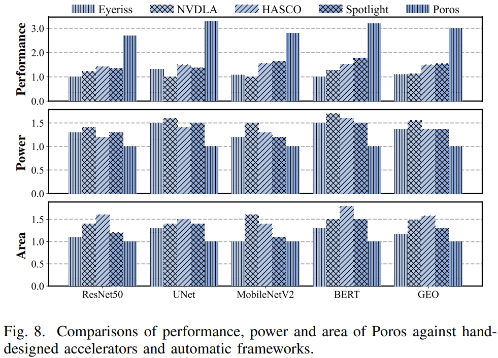
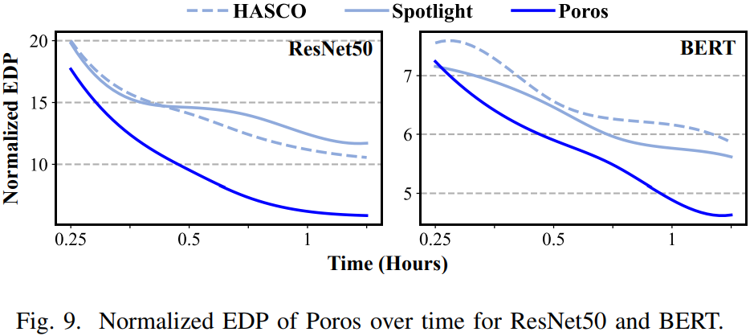
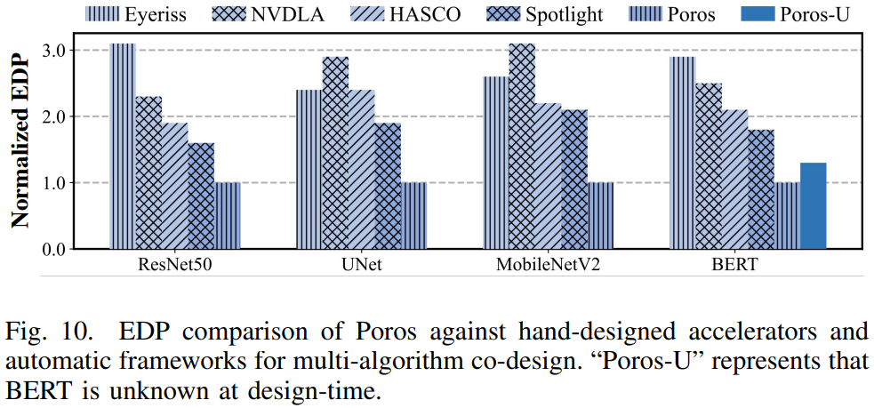
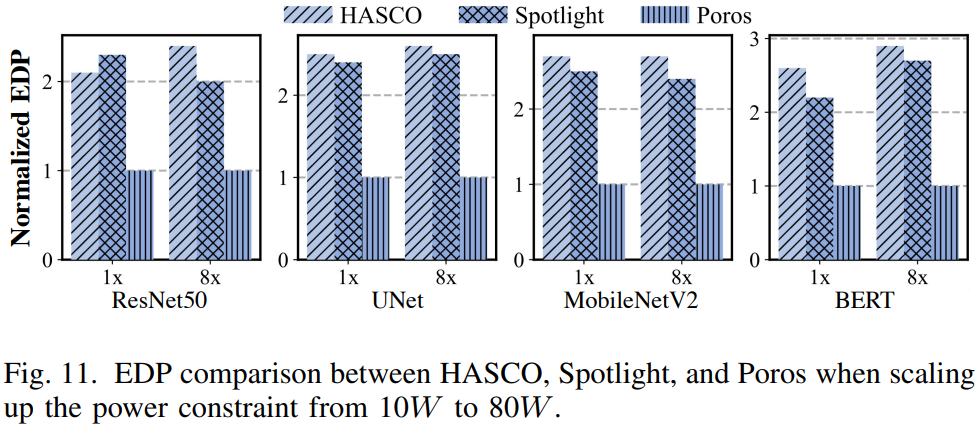

### Motivation
1.巨大联合设计空间
2.非凸和非可微空间
3.两层搜索

### Evaluation

### Reference
[Poros: One-Level Architecture-Mapping Co-Exploration for Tensor Algorithms](https://ieeexplore.ieee.org/stamp/stamp.jsp?tp=&arnumber=10992589)